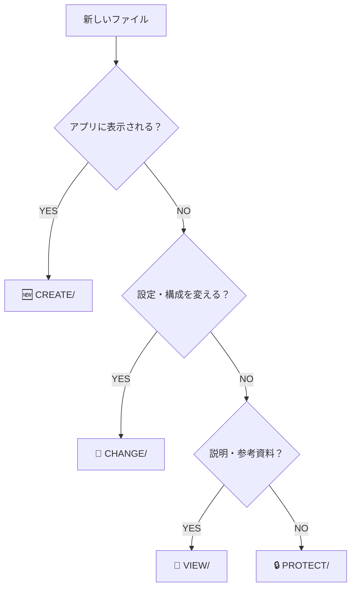

# ファイル分類フローチャート詳細版

## 🎯 基本フロー

## 📁 各フォルダの詳細

### 🆕 CREATE/ - 新しいアプリ機能
- **対象**: ユーザーが実際に見る・使うもの
- **例**: HTMLページ、React components、CSS、画像
- **判断基準**: 「これはアプリの画面に出てくる？」→ YES

### 🔧 CHANGE/ - 設定・構成変更
- **対象**: アプリの動作を変える設定・ツール
- **例**: config files、build scripts、deployment tools
- **判断基準**: 「これはアプリの動き方を変える？」→ YES

### 👀 VIEW/ - 説明・参考資料
- **対象**: 人間が読む説明・ドキュメント
- **例**: README、tutorials、specification docs
- **判断基準**: 「これは誰かが読むための説明？」→ YES

### 🔒 PROTECT/ - 重要システム
- **対象**: 変更すると危険な重要ファイル
- **例**: core system、security、critical infrastructure
- **判断基準**: 「これを間違って変更したら大問題？」→ YES

## 🤔 境界線のあるケース

### ボーダーケース1: 設定ファイル
- **package.json** → 🔧 CHANGE/ (アプリの構成を変える)
- **README.md** → 👀 VIEW/ (説明資料)
- **tsconfig.json** → 🔧 CHANGE/ (コンパイル設定)

### ボーダーケース2: テストファイル
- **unit tests** → 🔧 CHANGE/ (開発プロセスの一部)
- **test data** → 👀 VIEW/ (参考資料として)
- **integration tests** → 🔒 PROTECT/ (重要な品質保証)

### ボーダーケース3: スクリプト
- **build script** → 🔧 CHANGE/ (構成変更)
- **deployment script** → 🔒 PROTECT/ (重要システム)
- **utility script** → 🔧 CHANGE/ (開発ツール)

## 📝 判断プロセス

1. **3秒ルール**: 3秒以内に決められるように簡潔に
2. **主目的を考える**: そのファイルの一番の目的は？
3. **影響範囲を考える**: 変更した時の影響は？
4. **迷ったら相談**: テンプレートを使って相談

## 🆘 困った時は

`VIEW/examples/CONFUSION_REPORT_TEMPLATE.md` を使って相談してください。