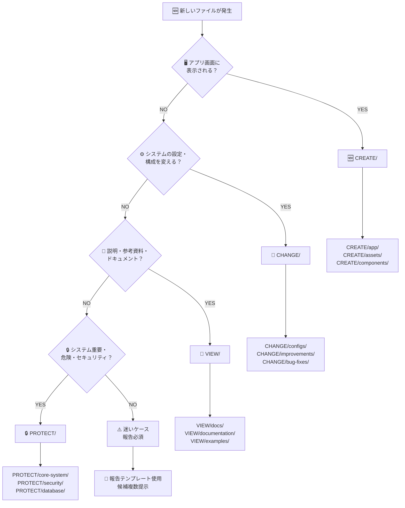

# 📊 ファイル分類フローチャート（決定版）

## 🎯 3秒判定フローチャート



## 🔍 詳細判定ガイド

### 🆕 CREATE/ 判定詳細

```
アプリ画面に表示される？
├─ YES → CREATE/
│  ├─ HTML/JSX → CREATE/app/web/
│  ├─ 画像・アイコン → CREATE/assets/
│  ├─ UIコンポーネント → CREATE/components/
│  └─ 新機能コード → CREATE/features/
└─ NO → 次の質問へ
```

**判定例**:
- `index.html` → YES (メイン画面)
- `icon-192.png` → YES (アプリアイコン)
- `manifest.json` → YES (PWA設定、UI関連)

### 🔧 CHANGE/ 判定詳細

```
システム設定・構成を変える？
├─ YES → CHANGE/
│  ├─ パッケージ管理 → CHANGE/configs/dependencies/
│  ├─ ビルド設定 → CHANGE/configs/build/
│  ├─ テスト設定 → CHANGE/improvements/tests/
│  └─ ツール設定 → CHANGE/configs/tools/
└─ NO → 次の質問へ
```

**判定例**:
- `package.json` → YES (依存関係管理)
- `tsconfig.json` → YES (TypeScript設定)
- `vite.config.ts` → YES (ビルドツール設定)

### 👀 VIEW/ 判定詳細

```
説明・参考資料・ドキュメント？
├─ YES → VIEW/
│  ├─ 使い方説明 → VIEW/docs/guides/
│  ├─ API仕様 → VIEW/docs/reference/
│  ├─ サンプルコード → VIEW/examples/
│  └─ 分析レポート → VIEW/reports/
└─ NO → 次の質問へ
```

**判定例**:
- `README.md` → YES (プロジェクト説明)
- `MANUAL.md` → YES (使用方法)
- `LICENSE` → YES (法的情報)

### 🔒 PROTECT/ 判定詳細

```
システム重要・危険・セキュリティ？
├─ YES → PROTECT/
│  ├─ コアシステム → PROTECT/core-system/
│  ├─ データベース → PROTECT/database/
│  ├─ セキュリティ → PROTECT/security/
│  └─ デプロイ設定 → PROTECT/deployment/
└─ NO → ⚠️ 報告ケース
```

**判定例**:
- `core/domain.ts` → YES (アプリコア)
- `auth.config.js` → YES (認証設定)
- `deploy.yml` → YES (デプロイ設定)

## ⚠️ よくある迷いケースと解決法

### 🤔 境界ケース集

| ファイル | 迷う理由 | 正解 | 判定根拠 |
|---------|----------|------|----------|
| `package.json` | アプリの一部？設定？ | 🔧 CHANGE | 依存関係管理=設定業務 |
| `manifest.json` | 設定？アプリ機能？ | 🆕 CREATE | PWA機能=ユーザー体験 |
| `version.json` | 管理？参照？ | 👀 VIEW | 主に参照目的 |
| `test.spec.ts` | 新機能？設定？ | 🔧 CHANGE | テスト=改善活動 |
| `api.ts` | アプリ？システム？ | 🆕 CREATE | アプリ機能の一部 |

### 🚨 迷った時の対応フロー

```
迷いが発生
↓
1. 既存事例を確認 (VIEW/examples/)
↓
2. 詳細ルールを確認 (CLASSIFICATION_RULES.md)
↓
3. それでも迷う場合は報告
↓
4. 報告テンプレート使用
↓
5. 複数候補提示
↓
6. 指示を待つ
```

## 📈 分類精度向上のコツ

### ✅ 成功パターン
- **機能重視**: ファイルの**主目的**で判定
- **使用頻度**: **編集頻度**を考慮
- **影響範囲**: **変更時の影響**を考慮

### ❌ 失敗パターン
- **拡張子重視**: `.json`だから設定、は危険
- **名前重視**: `config`があるから設定、は危険
- **推測判定**: 「たぶん」での判定は禁止

## 🎯 成功基準

- **第一印象3秒**: 迷わず分類できる
- **報告率20%**: 迷いケースの適切な報告
- **精度向上**: 報告により判定基準が改善

---

**重要**: このフローチャートで迷った場合は、**必ず報告**してください。あなたの報告が次の人の分類精度を向上させます。