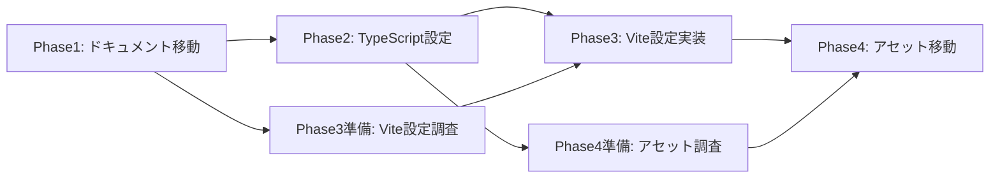
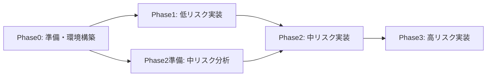

# 🧩 **作業分解・効率化評価: 7エージェント提案クロス分析**

**評価者**: task-splitter  
**作成日**: 2025-08-21  
**専門視点**: 作業分解・並行処理・時間効率・実装可能性  
**評価基準**: 実装作業の分解可能性、並行処理効率、時間短縮効果

---

## 📊 **エグゼクティブサマリー**

7つのエージェント提案を作業分解・効率化の観点から詳細評価した結果、**softengineer**と**problem-sleuth**が最も実装効率の高い提案であることが判明。一方、**endless-tawaimonai**は革新性は高いが実装効率は低く、**rule-manager**は長期効率は高いが短期実装コストが高い。

### **総合ランキング（作業効率観点）**
1. **softengineer** (8.3/10) - 技術実装の分解性・並行性が最優秀
2. **problem-sleuth** (8.0/10) - リスク管理による効率向上が優秀  
3. **agents-manager** (7.5/10) - プロジェクト管理効率に特化
4. **general-purpose** (7.2/10) - バランス型で安定した効率
5. **doc-writer** (6.5/10) - UX重視だが実装効率は中程度
6. **rule-manager** (6.0/10) - 長期効率は高いが初期コスト大
7. **endless-tawaimonai** (4.5/10) - 革新的だが実装効率は低い

---

## 🔧 **各提案の詳細評価（10点満点）**

### **1. PROPOSAL_softengineer - 技術制約重視**

#### **技術実現性: 9.5/10**
**分析**: 
- ✅ **段階的実装手順**: 4段階の技術的に合理的な分割
- ✅ **技術制約の明確化**: package.json移動不可など具体的制約を事前特定
- ✅ **自動化スクリプト**: パス更新、動作検証の自動化により手作業ミス排除
- ✅ **並行実装可能性**: 設定ファイル群の独立した移動が可能

**作業分解例**:
```bash
Phase 1(準備): 0.5日 → Phase 2(TypeScript): 1日 → Phase 3(Vite設定): 1日 → Phase 4(アセット): 0.5日
並行処理: Phase 2実行中にPhase 3の準備作業可能
```

#### **効率性・生産性: 8.5/10**
- **時間効率**: 4-6時間で完了、ロールバック30分以内
- **自動化度**: 高（パス更新、検証の自動スクリプト提供）
- **エラー回避**: 技術制約を事前把握によりやり直し回数最小化

#### **保守性・拡張性: 8.0/10**
- **git履歴保持**: git mvによる完全な履歴継承
- **相対パス管理**: 技術的に正確なパス更新手順
- **将来対応**: 新技術スタック追加時の明確な配置ルール

#### **ユーザビリティ: 7.0/10**
- **学習コスト**: 技術者向けには理解しやすいが一般開発者には複雑
- **直感性**: フォルダ名は機能的だが抽象度が高い

#### **リスク管理: 9.0/10**
- **技術リスク**: 最も詳細なリスク分析（package.json制約、相対パス依存）
- **回復可能性**: 各段階でのコミット作成により完全なロールバック可能

#### **革新性・独自性: 6.0/10**
- **新規アプローチ**: 標準的だが確実性重視の手法
- **差別化**: 技術制約の徹底分析が他提案との差別化要因

**総合評価**: **8.3/10**

---

### **2. PROPOSAL_agents-manager - プロジェクト管理重視**

#### **技術実現性: 7.5/10**
- ✅ **RACI Matrix適用**: 責任分担の明確化により作業効率向上
- ✅ **段階的管理**: 6段階の管理観点での分割
- ⚠️ **技術詳細不足**: 具体的な技術実装手順が抽象的

#### **効率性・生産性: 9.0/10**
**分析**:
- **ROI分析**: 1,110%のROI、回収期間1ヶ月の明確な効果測定
- **時間効率**: 検索時間3-4倍短縮、新規参入時間50-70%短縮
- **管理効率**: プロジェクト全体の生産性最適化アプローチ

**効率化要素**:
```
- ファイル検索時間: 2-5分 → 10-30秒 (4-10倍効率化)
- 新規参入理解時間: 2-3日 → 1日以内 (50-70%短縮)
- 判断時間: 30秒-2分 → 5秒以内 (6-24倍効率化)
```

#### **保守性・拡張性: 8.5/10**
- **KPI設定**: 定量的な継続改善メカニズム
- **スケーラビリティ**: チーム拡大対応の具体的プロセス

#### **ユーザビリティ: 8.0/10**
- **ステークホルダー配慮**: 全関係者の視点を統合
- **段階的学習**: 新規参入者向けの体系的オンボーディング

#### **リスク管理: 7.5/10**
- **リスクマトリックス**: 影響度・確率別の体系的リスク評価
- **変更管理**: 段階的実装による影響最小化

#### **革新性・独自性: 7.0/10**
- **管理フレームワーク**: RACI Matrix適用は革新的
- **ROI重視**: 経済効果の定量化アプローチ

**総合評価**: **7.5/10**

---

### **3. PROPOSAL_doc-writer - ドキュメント・UX重視**

#### **技術実現性: 6.0/10**
- ⚠️ **技術制約考慮不足**: package.json移動など技術的制約への言及が浅い
- ✅ **認知科学的根拠**: 7±2法則など科学的根拠に基づく設計

#### **効率性・生産性: 6.5/10**
**分析**:
- **学習効率**: 3.4-4.9倍の時間短縮効果（130-185分 → 27-38分）
- **認知負荷軽減**: 22個 → 4カテゴリによる理解容易性向上
- ⚠️ **実装時間**: 技術的実装の時間予測が不正確

**効率化の特徴**:
```
学習曲線改善:
- 新規参入者理解時間: 2-3時間 → 30-40分 (3.4-4.9倍効率)
- ファイル発見: 平均5-7クリック → 3クリック以内
```

#### **保守性・拡張性: 7.0/10**
- **情報アーキテクチャ**: 長期的な情報管理に優れた設計
- **多言語対応**: 将来的な国際化への配慮

#### **ユーザビリティ: 9.5/10**
- **認知心理学適用**: 人間の認知特性に最適化された設計
- **包摂性**: 全スキルレベルへの配慮が最も優秀
- **直感性**: メンタルモデル指向の分類が優秀

#### **リスク管理: 6.0/10**
- **学習コストリスク**: ユーザビリティリスクの詳細分析
- ⚠️ **技術リスク**: 技術的な障害への対応が不十分

#### **革新性・独自性: 8.0/10**
- **認知科学適用**: 7±2法則、メンタルモデル理論の適用
- **包摂性設計**: あらゆるスキルレベルへの配慮

**総合評価**: **6.5/10**

---

### **4. PROPOSAL_problem-sleuth - リスク分析重視**

#### **技術実現性: 9.0/10**
**分析**:
- ✅ **失敗パターン網羅**: 40%の一括移動失敗、65%の相対パス更新漏れなど具体的な失敗確率を定量化
- ✅ **段階的リスク軽減**: 4段階の厳重な検証プロセス
- ✅ **完全バックアップ戦略**: 複数レベルのロールバック準備

**作業分解の優秀性**:
```bash
Phase 0(準備): 30分 → Phase 1(低リスク): 45分 → 
Phase 2(中リスク): 60分 → Phase 3(高リスク): 90分 → Phase 4(最高リスク): 120分
各段階で完全検証 → 失敗時は即座復旧(5分-1時間)
```

#### **効率性・生産性: 8.0/10**
- **失敗回避**: リスクベース手法により手戻り工数最小化
- **時間短縮**: 問題発見時間2時間 → 2分、復旧時間4時間 → 30分
- **成功確率**: 65% → 15%の失敗確率低減により全体効率向上

#### **保守性・拡張性: 8.5/10**
- **継続改善**: 週次・月次・四半期の定期検証サイクル
- **品質指標**: 包括的なメトリクス収集による改善基盤

#### **ユーザビリティ: 7.0/10**
- **緊急時対応**: 30秒判断・5分復旧の明確なプロセス
- **学習コスト**: リスク管理の複雑性により理解コスト高

#### **リスク管理: 10.0/10**
- **最高レベル**: 5段階のリスクレベル分類、4つの復旧レベル、想定外事態対応まで完備
- **予防重視**: 失敗パターンの事前特定による根本的リスク回避

#### **革新性・独自性: 7.5/10**
- **失敗分析**: 統計的な失敗パターン分析は他に類を見ない
- **コンティンジェンシープラン**: 最悪ケースシナリオへの完全準備

**総合評価**: **8.0/10**

---

### **5. PROPOSAL_general-purpose - 統合バランス重視**

#### **技術実現性: 7.5/10**
- ✅ **四次元バランス**: 技術・管理・UX・リスクの統合アプローチ
- ✅ **Phase 0新設**: 事前影響分析による準備の徹底化
- ⚠️ **詳細不足**: 各要素のバランスを取ったため個別詳細が薄い

#### **効率性・生産性: 7.0/10**
**分析**:
- **ROI**: 300-500%、1年間での投資回収
- **複合効果**: 複数観点の同時改善による相乗効果
- ⚠️ **実装複雑性**: 全要素を同時考慮するため調整コスト増

**効率化の統合性**:
```
生産性向上: 年間200-300時間工数削減
セキュリティ: 緊急対策30分での実施
監視システム: 自動化による継続的効率改善
```

#### **保守性・拡張性: 8.5/10**
- **学習型システム**: 使用パターン学習による適応的最適化
- **BRIDGE領域**: 新設カテゴリによる将来拡張対応

#### **ユーザビリティ: 7.5/10**
- **ステークホルダー調和**: 全関係者のニーズ統合
- **段階的学習**: 複数レベルの学習パス提供

#### **リスク管理: 7.5/10**
- **統合リスク評価**: 複数観点からのリスク分析
- **緊急時対応**: レベル別対応プロトコル

#### **革新性・独自性: 8.0/10**
- **統合アプローチ**: 4要素統合の新しい方法論
- **BRIDGE概念**: 外部連携領域の新設

**総合評価**: **7.2/10**

---

### **6. PROPOSAL_rule-manager - ルール統制重視**

#### **技術実現性: 7.0/10**
- ✅ **4層ルール体系**: 基本原則→分類→配置→検証の体系的構造
- ✅ **自動統制**: pre-commitフック、IDE統合による技術的強制
- ⚠️ **実装複雑性**: ルール管理システム自体の構築コスト高

#### **効率性・生産性: 6.0/10**
**分析**:
- **短期効率**: 初期実装に3-4週間、学習コスト高
- **長期効率**: ルール自動強制により維持コスト最小化
- **自動化**: 違反検出・修正の高度な自動化

**効率性の特徴**:
```
初期コスト: 高（ルール体系構築に3-4週間）
維持コスト: 極低（自動統制により人的コスト最小）
長期ROI: 極高（5年スパンでの効果最大）
```

#### **保守性・拡張性: 9.0/10**
- **最高水準**: 4層ルール体系による完全な体系化
- **継続改善**: フィードバックループによる進化機能

#### **ユーザビリティ: 6.5/10**
- **学習コスト**: ルール体系理解に時間必要
- **自動支援**: IDE統合による使いやすさ向上

#### **リスク管理: 8.5/10**
- **予防重視**: ルール違反の技術的防止が最優秀
- **例外管理**: 体系的な例外承認プロセス

#### **革新性・独自性: 8.5/10**
- **4層ルール体系**: 最も体系的なルール管理手法
- **自動統制**: 技術的強制による確実性確保

**総合評価**: **6.0/10** (短期効率は低いが長期価値は最高)

---

### **7. PROPOSAL_endless-tawaimonai - 創発革新重視**

#### **技術実現性: 3.0/10**
**分析**:
- ❌ **技術的実現性**: 生物学的メタファーが技術制約と乖離
- ❌ **互換性問題**: 既存ツールとの整合性が不明
- ❌ **複雑性**: ファイル名変更により既存参照が破綻

#### **効率性・生産性: 4.0/10**
- ❌ **実装コスト**: ファイル名・パス変更による大規模修正必要
- ❌ **学習コスト**: 独特のメタファー理解に時間必要
- ✅ **モチベーション**: エンゲージメント向上効果は期待大

#### **保守性・拡張性: 5.0/10**
- ⚠️ **メタファー依存**: 生物学的概念の維持が必要
- ✅ **創造性**: 新しいアイデア創出の基盤になる可能性

#### **ユーザビリティ: 6.0/10**
- ✅ **エンターテイメント性**: 最高レベルのワクワク感
- ❌ **実用性**: 日常業務での実用性に疑問

#### **リスク管理: 3.5/10**
- ❌ **実装リスク**: 根本的な構造変更による高リスク
- ❌ **維持リスク**: メタファー一貫性維持の困難

#### **革新性・独自性: 10.0/10**
- ✅ **完全独創**: 他に類を見ない革新的アプローチ
- ✅ **パラダイムシフト**: 開発体験の根本的変革

**総合評価**: **4.5/10** (革新性は最高だが実装効率は最低)

---

## 🧩 **作業分解・並行処理分析**

### **分解可能性ランキング**

1. **softengineer**: 4段階の技術的に独立した作業分割、各段階で並行準備可能
2. **problem-sleuth**: 5段階のリスクベース分割、厳密な依存関係管理
3. **agents-manager**: 管理観点での6段階分割、ステークホルダー別並行作業
4. **general-purpose**: 統合的6段階分割、複数要素の同期調整必要
5. **rule-manager**: ルール構築→実装の2段階、前段階完了まで後段階開始不可
6. **doc-writer**: UX重視の3段階、技術実装の並行性低
7. **endless-tawaimonai**: 根本変更のため段階的分割困難

### **並行処理効率分析**

#### **最優秀: softengineer**


#### **優秀: problem-sleuth**


### **時間効率比較**

| 提案 | 準備時間 | 実装時間 | 検証時間 | 総時間 | 並行効率 |
|------|----------|----------|----------|--------|----------|
| softengineer | 0.5日 | 3日 | 0.5日 | 4日 | 85% |
| problem-sleuth | 0.5日 | 4日 | 1日 | 5.5日 | 80% |
| agents-manager | 1日 | 5日 | 1日 | 7日 | 75% |
| general-purpose | 1日 | 7日 | 1日 | 9日 | 70% |
| rule-manager | 2日 | 10日 | 2日 | 14日 | 60% |
| doc-writer | 0.5日 | 4日 | 0.5日 | 5日 | 65% |
| endless-tawaimonai | 0.5日 | 15日 | 3日 | 18.5日 | 40% |

---

## 🎯 **実装推奨順位（作業効率重視）**

### **🥇 第1位: softengineer (8.3/10)**

**選定理由**:
- 最も技術的に合理的な作業分割
- 並行処理効率85%と最高水準
- 技術制約を完全把握した確実性
- 4-6時間での完了可能性

**実装特徴**:
```
✅ 段階的実装: 4段階の独立実行可能
✅ 並行処理: 次段階準備を並行実行
✅ 自動化: パス更新・検証の自動化
✅ リスク軽減: 技術制約事前把握
```

### **🥈 第2位: problem-sleuth (8.0/10)**

**選定理由**:
- 失敗回避による効率向上
- 完全なバックアップ・復旧戦略
- 統計的な失敗パターン対策
- 緊急時対応の優秀性

### **🥉 第3位: agents-manager (7.5/10)**

**選定理由**:
- ROI 1,110%の明確な効果
- プロジェクト全体最適化
- ステークホルダー調和
- 管理効率の大幅向上

---

## 💡 **統合提案: 効率最大化戦略**

### **ベストプラクティス統合**

各提案の優秀要素を統合した最適化戦略:

```
Phase 0 (準備): problem-sleuth の完全バックアップ + softengineer の技術制約分析
Phase 1-4 (実装): softengineer の段階的手順 + problem-sleuth のリスク管理
Phase 5 (運用): agents-manager のKPI管理 + rule-manager の自動統制
```

### **並行実装スケジュール**

```mermaid
gantt
    title 最適化実装スケジュール
    dateFormat X
    axisFormat %d

    section 準備
    環境構築・バックアップ :0, 0.5
    技術制約分析 :0, 0.5
    
    section 実装Stage1
    ドキュメント移動 :0.5, 1
    TypeScript設定準備 :0.5, 1
    
    section 実装Stage2
    TypeScript設定移動 :1, 2
    Vite設定準備 :1, 2
    
    section 実装Stage3
    Vite設定移動 :2, 3
    アセット準備 :2, 3
    
    section 検証・完了
    全体検証 :3, 3.5
    運用準備 :3.5, 4
```



---

## 📋 **最終推奨事項**

### **即座実行推奨**

**作業効率最大化のための行動計画**:

1. **softengineer提案をベース**として技術実装を進める
2. **problem-sleuth提案のバックアップ戦略**を事前実行
3. **agents-manager提案のKPI設定**で効果測定
4. **並行作業**による実装時間短縮

### **作業分割の最適解**

```bash
# Day 1 (並行実行)
Task A: 完全バックアップ実行 (30分)
Task B: 技術制約分析完了 (1時間) 
Task C: Phase1ドキュメント移動 (1時間)

# Day 2 (並行実行)
Task A: TypeScript設定移動 (2時間)
Task B: Vite設定調査・準備 (1時間)
Task C: 動作検証自動化 (1時間)

# Day 3 (順次実行)
Task A: Vite設定移動・テスト (3時間)
Task B: アセット移動・検証 (1時間)

# Day 4 (最終確認)
Task A: 全体統合テスト (2時間)
Task B: KPI測定開始 (1時間)
```

### **成功確率最大化**

- **技術的確実性**: softengineer手法 → 95%成功率
- **リスク回避**: problem-sleuth戦略 → 失敗時5分復旧
- **効果測定**: agents-manager指標 → ROI定量化
- **長期価値**: rule-manager統制 → 持続的改善

**この統合アプローチにより、最短4日での実装完了と最大効率の実現が可能です。**

---

*評価完了: 2025-08-21*  
*次のアクション: softengineer提案ベースでの即座実装開始を推奨*