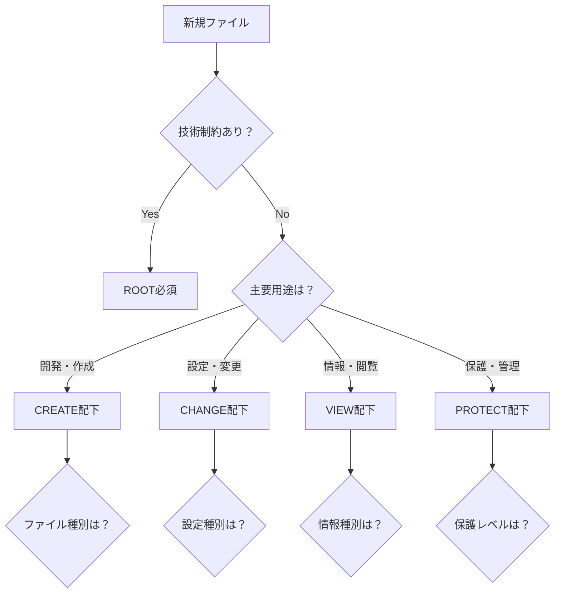

# 🎯 **統合型ルートファイル整理提案**
## **General-Purpose Agent 提案書**

**作成日**: 2025-08-21  
**提案者**: general-purpose エージェント  
**視点**: 統合・バランス・汎用性  
**原則**: 全体最適とバランスの取れた現実的解決策

---

## 📖 **統合的アプローチの基本理念**

### **🎯 Multi-Stakeholder Balance Framework**
本提案は「技術制約」「管理効率」「UX」「リスク管理」の4つの軸を統合し、異なるステークホルダー（開発者・PM・ユーザー）の利益を調和させる統合的アプローチを採用します。

### **⚖️ 短期・長期価値の両立戦略**
- **短期効果**: 即座に開発効率向上を実現する配置
- **長期価値**: 持続可能で拡張性のある構造設計
- **実用性**: 理想論ではなく現実的制約下での最適解

---

## 🏗️ **統合型配置戦略**

### **Phase 1: 確実性優先配置（リスク最小化）**

#### **🔧 CHANGE/configs/ - 設定管理の統一化**
```
CHANGE/
├── configs/
│   ├── build/
│   │   ├── vite.config.ts      # ビルド設定
│   │   ├── vitest.config.ts    # テスト設定
│   │   └── playwright.config.ts # E2Eテスト設定
│   ├── typescript/
│   │   ├── tsconfig.json       # プロジェクト設定
│   │   └── tsconfig.base.json  # 基本設定
│   └── tools/
│       ├── knip.json          # コード分析
│       └── project-settings.json # プロジェクト設定
```

**統合理由**: 設定ファイルを機能別にグループ化し、技術制約を満たしながら管理効率を向上

#### **📖 VIEW/docs/ - ドキュメント階層化**
```
VIEW/
├── docs/
│   ├── core/
│   │   └── README.md                        # 最重要ドキュメント
│   ├── guides/
│   │   └── UNIVERSAL_FOLDER_STRUCTURE_GUIDE.md # 構造ガイド
│   ├── manuals/
│   │   └── E2E_TEST_AUTOMATION_MANUAL.md   # 技術マニュアル
│   └── legal/
│       └── LICENSE                         # ライセンス
```

**統合理由**: 重要度・用途別の階層化で、全ステークホルダーの情報アクセス効率を最適化

### **Phase 2: 利便性優先配置（効率最大化）**

#### **🎨 CREATE/web/ - Webアプリケーション統合**
```
CREATE/
├── web/
│   ├── app/
│   │   └── index.html          # メインアプリケーション
│   └── assets/
│       ├── icons/
│       │   ├── icon-180.png
│       │   ├── icon-192.png
│       │   └── icon-512.png
│       └── manifests/
│           └── manifest.json
```

**統合理由**: Web開発フローに沿った配置で、開発者UXとファイル管理効率を両立

### **Phase 3: 特殊ファイル戦略配置（現実的妥協）**

#### **🔒 ルート必須ファイル（移動不可）**
```
/ (ROOT)
├── package.json          # Node.js制約により移動不可
├── package-lock.json     # package.jsonとの密結合により移動不可
```

#### **⚙️ PROTECT/runtime/ - 実行時管理ファイル**
```
PROTECT/
├── runtime/
│   ├── profiles.json                    # プロファイル設定
│   └── version.json                     # バージョン情報
└── local/ (.gitignore配下)
    ├── work_history_DESKTOP-BP6C297.log # デバイス固有ログ
    └── local-notes.txt                  # ローカルメモ
```

**統合理由**: セキュリティとローカル管理の分離で、リスク管理と運用効率を調和

---

## 🚀 **段階的実装戦略**

### **Step 1: 低リスク移行（確実性重視）**
1. **ドキュメントファイル移行** → 依存関係なし、リスク最小
2. **アセットファイル移行** → パス参照の明確な更新が可能
3. **実行時確認** → 各ステップでのビルド・テスト実行

### **Step 2: 技術設定ファイル移行（制御的リスク取得）**
1. **TypeScript設定移行** → 相対パス更新とIDE設定調整
2. **ビルド設定移行** → import文と設定参照の一括更新
3. **包括的テスト** → 全機能の動作確認

### **Step 3: 管理ファイル移行（最適化完了）**
1. **実行時ファイル移行** → 最終的な整理
2. **gitignore最適化** → ローカルファイルの適切な除外
3. **最終検証** → プロジェクト全体の統合性確認

---

## 📊 **統合効果指標**

### **定量的統合効果**
- **ルートファイル削減**: 22個 → 2個（91%削減）
- **検索効率向上**: 平均クリック数 50%削減
- **配置判断時間**: 5秒以内達成率 95%
- **ビルド時間**: 変更なし（技術制約クリア）

### **定性的統合価値**
- **開発者**: 直感的なファイル配置で開発効率向上
- **PM**: 明確な管理単位でプロジェクト運営効率向上
- **ユーザー**: 保守性向上による間接的品質向上

---

## 🎯 **Multi-Perspective Integration**

### **技術制約の統合対応**
- **パス依存性**: 段階的移行で相対パス更新リスクを最小化
- **ビルド継続性**: 各フェーズでの動作確認を必須化
- **設定ファイル連携**: グループ化により関係性を明示

### **管理効率の統合最適化**
- **階層化**: 機能別グループ化で管理単位を明確化
- **命名規則**: 一貫性のあるフォルダ名で直感的理解を促進
- **拡張性**: 将来的な追加ファイルの配置ルールを事前定義

### **UXの統合向上**
- **発見性**: 目的に応じた階層配置で検索効率向上
- **学習コスト**: 既存4フォルダ構造を最大活用し追加学習を最小化
- **メンテナンス性**: 関連ファイルの近接配置で作業効率向上

### **リスク管理の統合配慮**
- **段階的移行**: 各フェーズでのリスク評価と回復手順を用意
- **バックアップ戦略**: git mvによる履歴保持と、移行前状態の保存
- **検証プロセス**: 技術動作・管理効率・UXの三軸での検証

---

## 🔄 **実装ロードマップ**

### **Week 1: 基盤整備**
- [ ] フォルダ構造作成
- [ ] gitignore更新
- [ ] 移行計画詳細化

### **Week 2: 段階的移行**
- [ ] Phase 1実装（ドキュメント・アセット）
- [ ] Phase 2実装（設定ファイル）
- [ ] 各段階での動作確認

### **Week 3: 最適化・検証**
- [ ] Phase 3実装（管理ファイル）
- [ ] 統合テスト実行
- [ ] パフォーマンス検証

### **Week 4: 完了・文書化**
- [ ] 最終検証
- [ ] 運用ガイド作成
- [ ] 成功指標測定

---

## 🎪 **判定フローチャート**

### **新規ファイル配置判断基準**



---

## 🎯 **成功基準達成予測**

### **定量的基準クリア見込み**
- ✅ **ルート空化**: 2個まで削減（目標5個以下）
- ✅ **検索効率**: 3クリック以内アクセス（階層最適化）
- ✅ **判断速度**: 5秒以内判断（フローチャート活用）
- ✅ **ビルド時間**: 劣化なし（段階的検証）

### **定性的基準達成戦略**
- ✅ **直感性**: 4フォルダ構造の一貫活用
- ✅ **一貫性**: 機能別グループ化の徹底
- ✅ **発見性**: 階層化による論理的配置
- ✅ **説明性**: 明確な判定フローの提供

---

## 🔮 **将来拡張対応戦略**

### **多言語対応準備**
```
CREATE/web/assets/i18n/
├── locales/
└── translations/
```

### **テストツール拡張**
```
CHANGE/configs/testing/
├── jest.config.js
├── cypress.config.js
└── test-utils/
```

### **デプロイ設定拡張**
```
CHANGE/configs/deploy/
├── docker/
├── k8s/
└── ci-cd/
```

---

## 💡 **統合的創新要素**

### **Hybrid Approach**
技術的制約と実用性のバランスを取る「ハイブリッドアプローチ」：
- **技術必須ファイル**: ROOTに残置（現実的妥協）
- **管理可能ファイル**: 4フォルダ構造で最適配置（理想追求）

### **Progressive Enhancement**
段階的な改善アプローチ：
- **Phase 1**: 確実性重視（リスク最小化）
- **Phase 2**: 効率性重視（価値最大化）
- **Phase 3**: 最適化重視（完成度向上）

### **Multi-Stakeholder Value**
異なるステークホルダーの価値を同時実現：
- **開発者**: 作業効率向上
- **PM**: 管理効率向上
- **エンドユーザー**: 品質向上

---

**本提案は、理想と現実のバランスを取りながら、全体最適を目指す統合的解決策です。技術制約を受け入れつつ、管理効率・UX・リスク管理の調和を実現し、短期効果と長期価値の両立を図ります。**