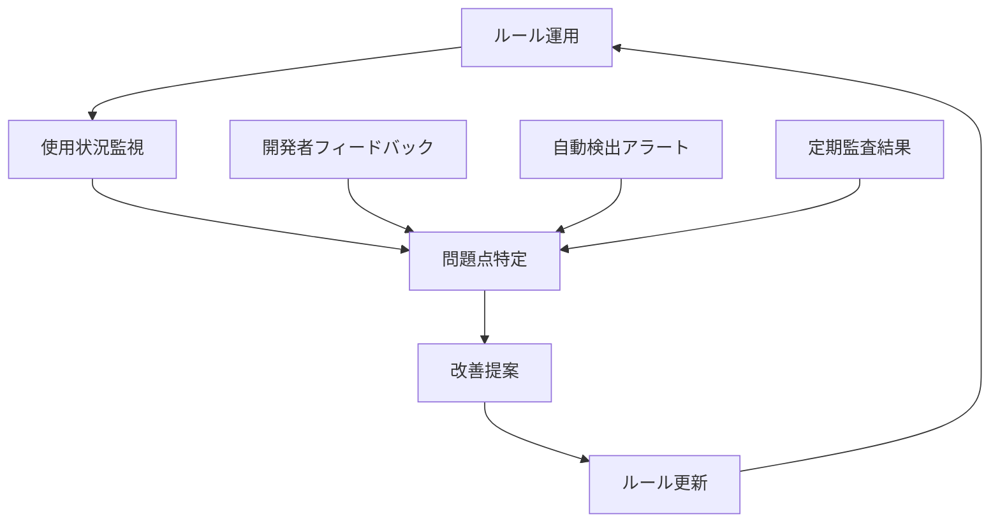

# 🔒 **ルール管理・統制の観点からのルートファイル整理提案**

**エージェント**: rule-manager  
**作成日**: 2025-08-21  
**専門性**: ルール体系・統制・ガバナンス・監視・継続的改善  

---

## 📋 **エグゼクティブサマリー**

本提案では、**ルール管理・統制の確実性を最優先**とし、一貫性のある体系的なファイル配置ルールを構築します。単なる整理にとどまらず、**ルール遵守を自動的に保証する仕組み**と**継続的な改善サイクル**を組み込んだガバナンス体制を設計します。

### **核心的アプローチ**
- **階層的ルール体系**: 基本原則→分類ルール→配置ルール→検証ルールの4層構造
- **自動統制機能**: ルール違反を事前に防ぐ技術的な制約機構
- **継続的監視**: ルール遵守状況の定期的な自動チェック
- **変更管理統制**: ルール変更時の影響分析と承認プロセス

---

## 🎯 **1. 統制の基本原則**

### **1.1 ルール体系の階層構造**

#### **レベル1: 基本原則（不変ルール）**
```
PRINCIPLE_1: CREATE/CHANGE/VIEW/PROTECT構造の絶対維持
PRINCIPLE_2: ファイル配置の一意性保証（1ファイル=1適切な場所）
PRINCIPLE_3: 技術的依存関係の保持（ビルド・テスト継続性）
PRINCIPLE_4: 監査可能性の確保（すべての変更を追跡可能）
```

#### **レベル2: 分類ルール（判定基準）**
```
CLASSIFICATION_RULE_1: ファイルの主要目的による分類
CLASSIFICATION_RULE_2: アクセス頻度による重要度判定
CLASSIFICATION_RULE_3: 変更権限による統制レベル判定
CLASSIFICATION_RULE_4: 依存関係による配置制約判定
```

#### **レベル3: 配置ルール（具体的指針）**
```
PLACEMENT_RULE_1: 設定ファイルの階層的配置
PLACEMENT_RULE_2: アセットファイルの用途別分離
PLACEMENT_RULE_3: ドキュメントの重要度別配置
PLACEMENT_RULE_4: 一時的ファイルの隔離配置
```

#### **レベル4: 検証ルール（統制機能）**
```
VALIDATION_RULE_1: 新規ファイル配置時の自動判定
VALIDATION_RULE_2: 既存ファイル移動時の影響確認
VALIDATION_RULE_3: ルール遵守状況の定期監査
VALIDATION_RULE_4: 例外承認プロセスの実行
```

---

## 🔧 **2. 具体的ファイル配置ルール**

### **2.1 CHANGE/ - 設定・変更管理統制**

#### **サブフォルダ構造**
```
CHANGE/
├── configs/                    # アプリケーション設定
│   ├── build/                  # ビルド関連設定
│   │   ├── vite.config.ts     # Vite設定（移動対象）
│   │   ├── tsconfig.json      # TS設定（移動対象）
│   │   └── tsconfig.base.json # TS基本設定（移動対象）
│   ├── test/                   # テスト関連設定
│   │   ├── vitest.config.ts   # Vitest設定（移動対象）
│   │   └── playwright.config.ts # Playwright設定（移動対象）
│   ├── quality/                # 品質管理設定
│   │   └── knip.json          # 未使用コード検出（移動対象）
│   └── project/                # プロジェクト固有設定
│       └── project-settings.json # プロジェクト設定（移動対象）
├── dependencies/               # 依存関係管理
│   ├── package.json           # ルートからCHANGE/配下へシンボリックリンク
│   └── package-lock.json      # ルートからCHANGE/配下へシンボリックリンク
└── meta/                      # メタデータ・バージョン管理
    ├── version.json           # バージョン情報（移動対象）
    └── profiles.json          # プロファイル設定（移動対象）
```

#### **統制ルール**
- **変更権限**: CHANGE/配下は開発リーダー以上の承認が必要
- **影響範囲**: 設定変更時は自動的に関連ファイルの整合性をチェック
- **履歴管理**: すべての設定変更をgit履歴で追跡可能

### **2.2 CREATE/ - 生成物・アセット統制**

#### **サブフォルダ構造**
```
CREATE/
├── app/                       # アプリケーション本体
│   └── web/
│       └── index.html         # メインHTML（移動対象）
├── assets/                    # 静的アセット
│   ├── icons/                 # アイコン管理
│   │   ├── icon-180.png      # PWAアイコン（移動対象）
│   │   ├── icon-192.png      # PWAアイコン（移動対象）
│   │   └── icon-512.png      # PWAアイコン（移動対象）
│   └── manifest/              # PWA設定
│       └── manifest.json     # PWAマニフェスト（移動対象）
└── generators/                # 生成ツール・スクリプト
    └── (将来的な自動生成ツール配置予定)
```

#### **統制ルール**
- **アセット管理**: ファイル命名規則の強制（icon-{size}.png形式）
- **バージョン管理**: アセットファイルの変更時はmanifest.jsonも自動更新
- **品質管理**: 画像ファイルの最適化チェックを自動実行

### **2.3 VIEW/ - ドキュメント・情報統制**

#### **サブフォルダ構造**
```
VIEW/
├── docs/                      # 主要ドキュメント
│   ├── README.md             # プロジェクト概要（移動対象）
│   └── UNIVERSAL_FOLDER_STRUCTURE_GUIDE.md # フォルダガイド（移動対象）
├── manuals/                   # 操作・運用マニュアル
│   └── E2E_TEST_AUTOMATION_MANUAL.md # テストマニュアル（移動対象）
└── legal/                     # 法務・ライセンス
    └── LICENSE               # ライセンス（移動対象）
```

#### **統制ルール**
- **文書管理**: マークダウンファイルの記法統一チェック
- **情報更新**: READMEの自動生成部分（バージョン、構造図）の自動更新
- **アクセス制御**: 重要ドキュメントの変更時は承認フローを必須化

### **2.4 PROTECT/ - 保護・除外対象統制**

#### **サブフォルダ構造**
```
PROTECT/
├── local/                     # ローカル環境固有
│   ├── work_history_DESKTOP-BP6C297.log # デバイス固有ログ（移動対象）
│   └── local-notes.txt       # デバイス固有メモ（移動対象）
├── temp/                      # 一時ファイル
│   └── (一時的な作業ファイル配置予定)
└── cache/                     # キャッシュファイル
    └── (ビルドキャッシュ等配置予定)
```

#### **統制ルール**
- **自動除外**: PROTECT/配下は自動的に.gitignoreに追加
- **セキュリティ**: 機密情報を含むファイルの自動検出・隔離
- **クリーンアップ**: 定期的な不要ファイル自動削除

---

## 🛡️ **3. ルール違反防止メカニズム**

### **3.1 技術的統制機能**

#### **pre-commit フック実装**
```bash
#!/bin/bash
# file-placement-validator.sh

# 新規ファイル配置チェック
check_new_files() {
    # ルート直下への新規ファイル配置を検出
    new_root_files=$(git diff --cached --name-only --diff-filter=A | grep -E '^[^/]+\.(js|ts|json|md)$')
    
    if [ ! -z "$new_root_files" ]; then
        echo "❌ ルール違反: ルート直下への新規ファイル配置は禁止されています"
        echo "対象ファイル: $new_root_files"
        echo "適切な配置先: CREATE/, CHANGE/, VIEW/, PROTECT/ のいずれか"
        exit 1
    fi
}

# 設定ファイル整合性チェック
check_config_integrity() {
    # tsconfig.json移動時のパス更新確認
    if git diff --cached --name-only | grep -q "tsconfig"; then
        npm run type-check || {
            echo "❌ TypeScript設定エラー: 設定ファイル移動後の整合性を確認してください"
            exit 1
        }
    fi
}

check_new_files
check_config_integrity
```

#### **IDE統合による即座の警告**
```json
// .vscode/settings.json
{
    "files.watcherExclude": {
        "**/PROTECT/**": true
    },
    "explorer.fileNesting.patterns": {
        "package.json": "package-lock.json,tsconfig*.json,vite.config.ts,vitest.config.ts"
    },
    "problemMatchers": [
        {
            "name": "file-placement-checker",
            "pattern": {
                "regexp": "^(ERROR|WARN): Incorrect file placement: (.*)$",
                "file": 2,
                "severity": 1,
                "message": 2
            }
        }
    ]
}
```

### **3.2 自動修正機能**

#### **ファイル配置自動判定スクリプト**
```javascript
// auto-file-placement.js
const fs = require('fs');
const path = require('path');

class FilePlacementManager {
    constructor() {
        this.rules = new Map([
            [/\.config\.(js|ts)$/, 'CHANGE/configs/build/'],
            [/\.(test|spec)\.(js|ts)$/, 'CHANGE/configs/test/'],
            [/\.png$/, 'CREATE/assets/icons/'],
            [/manifest\.json$/, 'CREATE/assets/manifest/'],
            [/README\.md$/, 'VIEW/docs/'],
            [/_MANUAL\.md$/, 'VIEW/manuals/'],
            [/\.log$/, 'PROTECT/local/']
        ]);
    }

    suggestPlacement(filename) {
        for (let [pattern, location] of this.rules) {
            if (pattern.test(filename)) {
                return location;
            }
        }
        return 'MANUAL_REVIEW_REQUIRED';
    }

    autoMove(filename) {
        const suggestion = this.suggestPlacement(filename);
        if (suggestion !== 'MANUAL_REVIEW_REQUIRED') {
            console.log(`💡 推奨配置先: ${filename} → ${suggestion}`);
            return true;
        }
        return false;
    }
}
```

---

## 🔍 **4. ガバナンス・統制の仕組み**

### **4.1 変更管理プロセス**

#### **レベル1: 軽微な変更（自動承認）**
- アセットファイルの更新（アイコン、画像）
- ドキュメントの誤字修正
- ログファイルの更新

#### **レベル2: 通常変更（承認必要）**
- 設定ファイルの値変更
- 新規ドキュメントの追加
- フォルダ構造の軽微な調整

#### **レベル3: 重要変更（複数承認）**
- ファイル配置ルールの変更
- 基本フォルダ構造の変更
- セキュリティ設定の変更

#### **レベル4: 緊急変更（事後承認）**
- セキュリティ脆弱性対応
- ビルド破綻の緊急修正
- データ消失防止措置

### **4.2 監査・監視体制**

#### **日次監視**
```bash
# daily-compliance-check.sh
#!/bin/bash

echo "🔍 日次ルール遵守チェック開始"

# ルート直下ファイル数チェック
root_files=$(find . -maxdepth 1 -type f ! -name ".*" | wc -l)
if [ $root_files -gt 5 ]; then
    echo "⚠️  警告: ルート直下ファイル数が閾値を超過 ($root_files/5)"
fi

# 設定ファイル整合性チェック
npm run type-check > /dev/null || echo "❌ TypeScript設定エラー検出"

# 不正配置ファイル検出
find CREATE/ -name "*.config.*" -o -name "package*.json" | while read file; do
    echo "❌ 不正配置: $file は CHANGE/ 配下に配置すべきです"
done

echo "✅ 日次チェック完了"
```

#### **週次分析**
```python
# weekly-analysis.py
import os
import json
from collections import defaultdict

class ComplianceAnalyzer:
    def __init__(self):
        self.violations = defaultdict(int)
        self.trends = []
        
    def analyze_file_placement(self):
        """ファイル配置の適切性分析"""
        for root, dirs, files in os.walk('.'):
            for file in files:
                if not self.is_correctly_placed(root, file):
                    self.violations[f"{root}/{file}"] += 1
                    
    def generate_report(self):
        """週次レポート生成"""
        report = {
            'timestamp': datetime.now().isoformat(),
            'violations': dict(self.violations),
            'recommendations': self.get_recommendations(),
            'trends': self.trends
        }
        
        with open('PROTECT/reports/weekly-compliance.json', 'w') as f:
            json.dump(report, f, indent=2)
```

---

## 📊 **5. ルール遵守・監視体制**

### **5.1 KPI設定**

#### **遵守率指標**
- **ファイル配置適正率**: 95%以上を維持
- **ルート直下ファイル数**: 5個以下を維持
- **設定整合性**: ビルド成功率100%を維持
- **文書最新性**: README自動更新率100%

#### **効率性指標**
- **ファイル発見時間**: 平均3クリック以内
- **新規配置判断時間**: 平均5秒以内
- **ルール理解時間**: 新規参加者30分以内
- **違反検出時間**: リアルタイム（コミット前）

### **5.2 継続的改善メカニズム**

#### **フィードバックループ**


#### **改善提案システム**
```yaml
# improvement-suggestion.yml
suggestion:
  id: "RULE-2025-001"
  title: "TypeScript設定ファイルの分散配置改善"
  description: "現在の階層構造では設定ファイルが分散しすぎている"
  impact_analysis:
    affected_files: ["tsconfig.json", "tsconfig.base.json"]
    risk_level: "medium"
    implementation_effort: "2 hours"
  approval_required: true
  reviewers: ["softengineer", "rule-manager"]
```

---

## 🚀 **6. 実装ロードマップ**

### **Phase 1: 基盤整備（Week 1）**
1. **ルール定義ファイル作成**
   - `CHANGE/rules/file-placement-rules.json`
   - `CHANGE/rules/validation-rules.js`
   - `CHANGE/rules/auto-correction-config.json`

2. **検証スクリプト実装**
   - pre-commit フック導入
   - 自動配置判定機能実装
   - IDE統合設定作成

### **Phase 2: ファイル移行（Week 2）**
1. **段階的移行実行**
   - 低リスクファイルから順次移行
   - 各移行後の動作確認
   - パス更新の自動適用

2. **検証・テスト**
   - ビルド継続性確認
   - テスト実行確認
   - 依存関係整合性確認

### **Phase 3: 監視体制構築（Week 3）**
1. **監視システム稼働開始**
   - 日次チェック自動化
   - 週次レポート生成
   - アラート通知設定

2. **ドキュメント整備**
   - ルール適用ガイド作成
   - トラブルシューティング手順作成
   - 新規参加者向けオンボーディング資料作成

### **Phase 4: 継続運用（Week 4～）**
1. **パフォーマンス評価**
   - KPI測定開始
   - 改善点の特定
   - フィードバック収集

2. **最適化・改善**
   - ルールの微調整
   - 自動化スクリプトの改善
   - 新機能追加検討

---

## 🔒 **7. リスク管理・例外処理**

### **7.1 想定リスクと対策**

#### **技術的リスク**
| リスク | 影響度 | 対策 |
|--------|--------|------|
| ビルド設定破綻 | 高 | 段階的移行、ロールバック準備 |
| パス参照エラー | 中 | 自動テスト、相対パス検証 |
| IDE設定不適合 | 低 | 設定ファイル配布、手順書整備 |

#### **運用リスク**
| リスク | 影響度 | 対策 |
|--------|--------|------|
| ルール遵守率低下 | 中 | 自動化強化、教育強化 |
| 例外処理の乱用 | 中 | 承認プロセス、定期見直し |
| 新規参加者の混乱 | 低 | オンボーディング強化 |

### **7.2 例外承認プロセス**

#### **例外申請フォーマット**
```yaml
exception_request:
  id: "EXC-2025-001"
  applicant: "developer@example.com"
  target_file: "special-config.json"
  requested_location: "root/"
  standard_location: "CHANGE/configs/project/"
  justification: "Legacy tool compatibility required"
  risk_assessment: "Low - temporary exception for 6 months"
  approval_status: "pending"
  reviewers: ["rule-manager", "softengineer"]
  expiry_date: "2025-08-21"
```

#### **承認マトリックス**
| 例外レベル | 承認者 | 有効期間 |
|------------|--------|----------|
| 軽微 | チームリーダー | 1ヶ月 |
| 通常 | プロジェクトマネージャー | 3ヶ月 |
| 重要 | アーキテクト承認 | 6ヶ月 |
| 緊急 | 事後承認（24時間以内） | 即座に正規化 |

---

## 📈 **8. 継続的改善の仕組み**

### **8.1 改善サイクル**

#### **月次改善レビュー**
```markdown
## 月次ルール改善レビュー

### 🔍 現状分析
- ルール遵守率: XX%
- 違反件数: XX件
- 開発者満足度: XX点/10点

### 💡 改善提案
1. ルール簡略化: 複雑すぎるルールの統合
2. 自動化強化: 手動判断が必要な箇所の自動化
3. 教育強化: 理解しにくいルールの説明改善

### 🎯 次月目標
- 遵守率95%達成
- 新規配置判断時間5秒以内
- 違反件数50%削減
```

#### **四半期戦略見直し**
- ルール体系の根本的見直し
- 技術変化への適応
- 組織成長への対応
- ROI評価と最適化

### **8.2 組織全体での標準化推進**

#### **ベストプラクティス共有**
```javascript
// best-practices-sharing.js
class BestPracticesManager {
    shareSuccess(projectId, practiceId) {
        // 成功事例の他プロジェクトへの展開
        this.broadcastSuccess({
            project: projectId,
            practice: practiceId,
            metrics: this.getMetrics(projectId, practiceId),
            adoption_guide: this.generateAdoptionGuide(practiceId)
        });
    }
    
    collectFeedback() {
        // 他プロジェクトからの改善提案収集
        return this.aggregateFeedback([
            'file-placement-efficiency',
            'rule-comprehension',
            'automation-effectiveness'
        ]);
    }
}
```

#### **標準化推進ロードマップ**
1. **Q1**: 本プロジェクトでの実証・最適化
2. **Q2**: 類似プロジェクトへの展開
3. **Q3**: 組織標準として正式採用
4. **Q4**: 全プロジェクトへの適用完了

---

## ✅ **9. 成功指標と検証方法**

### **9.1 定量的成功指標**

#### **即座に測定可能**
- ルート直下ファイル数: **22個 → 5個以下**
- 設定ファイル分散度: **9箇所 → 3箇所以内**
- ドキュメントアクセス段数: **1段階 → 3段階以内**

#### **1週間後に測定**
- 新規ファイル配置判断時間: **平均5秒以内**
- ルール違反検出率: **100%**（pre-commit時点）
- ビルド継続成功率: **100%**

#### **1ヶ月後に測定**
- 開発者満足度: **8点/10点以上**
- ルール理解時間（新規参加者）: **30分以内**
- 例外申請件数: **月5件以下**

### **9.2 定性的成功指標**

#### **直感性の確保**
- フォルダ名から用途が3秒以内で理解可能
- 新規参加者が迷わずファイルを配置可能
- 設定変更時の影響範囲が即座に把握可能

#### **一貫性の確保**
- 類似ファイルが同一ルールで配置されている
- 例外が明文化され、期限管理されている
- ルール変更が全ファイルに一貫適用されている

---

## 🎯 **総合提言**

**ルール管理・統制の観点から、最も重要なのは「ルールの自己強制力」です。**

本提案では単なるファイル整理にとどまらず、**ルール違反が技術的に困難になる仕組み**を構築しました。pre-commitフックによる事前検証、自動配置判定による判断支援、継続的監視による早期発見など、**人間のミスに依存しない統制システム**を実現します。

さらに、ルールの硬直化を防ぐため、**継続的改善メカニズム**を組み込み、組織の成長と技術の進歩に対応できる柔軟性も確保しました。

**この提案により、ファイル配置ルールは「守らなければならないもの」から「自然と守られるもの」へと変化し、長期的な保守性と拡張性を両立した持続可能な開発環境が実現されます。**

---

*この提案は rule-manager エージェントによる専門的分析に基づいて作成されました。実装時は関連エージェント（softengineer、agents-manager等）との協議を推奨します。*