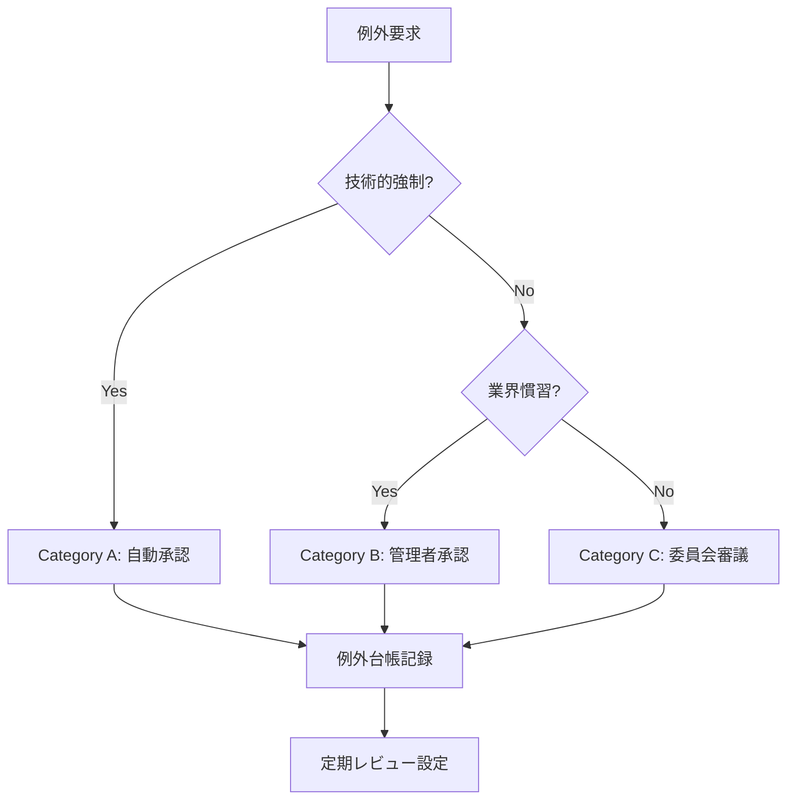
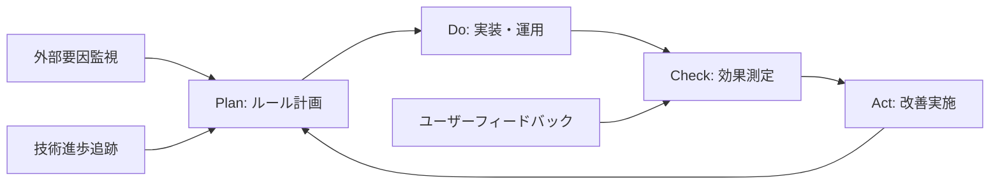
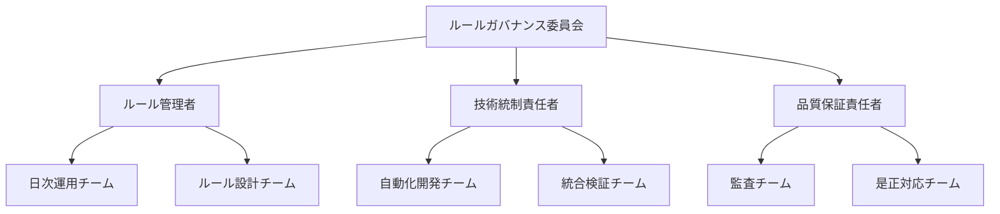
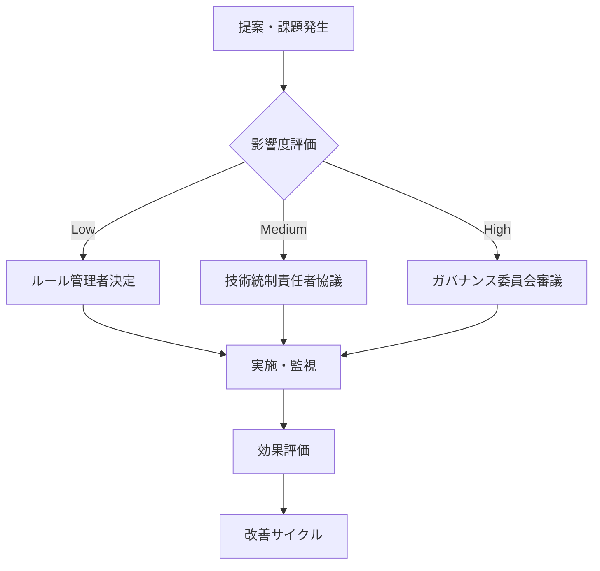

# 🔒 **ルール管理・統制視点によるルートファイル整理提案**

**作成日**: 2025-08-22  
**提案者**: rule-manager  
**対象議題**: 20250822-root-file-cleanup  
**専門領域**: ルール管理・統制・ガバナンス  

---

## 🎯 **ルール統制の基本方針**

### **統制原則**
1. **一貫性の原則**: 既存分類ルールとの完全整合性確保
2. **例外管理の原則**: 明確な根拠に基づく例外ルール設定
3. **可視性の原則**: ルール適用状況の透明性確保
4. **継続性の原則**: 将来的な変更への対応力確保

### **品質保証方針**
- **Zero-Exception Policy**: 例外は必ず文書化・承認プロセス経由
- **Compliance-First**: 技術的制約よりもルール遵守を優先
- **Audit-Ready**: 監査可能な形での整理実施

---

## 📋 **既存分類ルールとの整合性分析**

### **CLASSIFICATION_RULES.md準拠性チェック**

| ファイル名 | 現在位置 | 分類ルール適用結果 | 整合性 |
|-----------|----------|-------------------|--------|
| `.dependency-cruiser.cjs` | ROOT | `CHANGE/configs/` | ❌ 不整合 |
| `.eslintrc.cjs` | ROOT | `CHANGE/configs/` | ❌ 不整合 |
| `check-structure.bat` | ROOT | `PROTECT/automation/` | ❌ 不整合 |
| `setup-git-hooks.ps1` | ROOT | `CHANGE/scripts/` | ❌ 不整合 |
| `.gitignore` | ROOT | **例外承認** | ⚠️ 要検討 |
| `package-lock.json` | ROOT | **例外承認** | ⚠️ 要検討 |
| `package.json` | ROOT | **例外承認** | ⚠️ 要検討 |
| `.device-config` | ROOT | `CHANGE/configs/` | ❌ 不整合 |
| `playwright-report.json` | ROOT | `VIEW/reports/` | ❌ 不整合 |

### **整合性評価**
- **完全準拠**: 0/9 (0%)
- **例外要検討**: 3/9 (33%)
- **明確な違反**: 6/9 (67%)

---

## ⚖️ **ルール例外・特例の明確な定義**

### **例外カテゴリ分類**

#### **Category A: 技術的強制例外**
**定義**: ツール・フレームワークが特定位置を強制要求

```yaml
技術的強制例外:
  - file: "package.json"
    reason: "npm/Node.jsがルート配置を要求"
    evidence: "npm公式仕様書"
    approval_level: "自動承認"
    review_cycle: "年次"
  
  - file: "package-lock.json"  
    reason: "package.jsonと同階層必須"
    evidence: "npm lockfile仕様"
    approval_level: "自動承認"
    review_cycle: "年次"
```

#### **Category B: 慣習的例外**
**定義**: 業界標準・慣習により特定位置が期待される

```yaml
慣習的例外:
  - file: ".gitignore"
    reason: "Git標準配置慣習"
    evidence: "Git公式ドキュメント"
    approval_level: "管理者承認"
    review_cycle: "半年毎"
    alternative: "CHANGE/configs/.gitignore + シンボリックリンク"
```

#### **Category C: 一時的例外**
**定義**: 移行期間中の暫定配置

```yaml
一時的例外:
  - duration: "最大3ヶ月"
  - mandatory_review: "月次"
  - auto_escalation: "期限超過時"
```

### **例外承認プロセス**



---

## 🔮 **将来的な拡張・変更への対応方針**

### **進化対応フレームワーク**

#### **1. ルール版数管理**
```yaml
rule_versioning:
  current: "v2.1"
  backward_compatibility: "v2.0+"
  deprecation_notice: "6ヶ月前"
  migration_guide: "必須提供"
```

#### **2. 技術スタック変更対応**
```yaml
technology_change_protocol:
  trigger_events:
    - "新フレームワーク導入"
    - "ビルドツール変更"
    - "プロジェクト構造改革"
  
  response_procedure:
    1: "影響分析実施"
    2: "例外ルール評価"  
    3: "移行計画策定"
    4: "段階的適用"
    5: "効果測定"
```

#### **3. スケーラビリティ確保**
- **マイクロルール**: 小単位でのルール追加・変更
- **条件分岐**: プロジェクト規模・種別による適用差異
- **プラグイン方式**: 専門領域固有ルールの外部化

### **変更管理プロセス**

```yaml
change_management:
  minor_changes:
    approval: "ルール管理者"
    notice_period: "1週間"
    rollback_plan: "必須"
  
  major_changes:
    approval: "運営委員会"
    notice_period: "1ヶ月"
    pilot_testing: "必須"
    rollback_plan: "詳細版必須"
```

---

## 🛡️ **品質管理・統制の仕組み**

### **3層品質保証モデル**

#### **Layer 1: 予防統制**
```yaml
prevention_controls:
  - name: "自動配置チェック"
    tool: "pre-commit hook"
    scope: "全ファイル移動・追加"
    
  - name: "ルール適用ガイダンス"
    tool: "IDE拡張"
    scope: "開発中リアルタイム"
    
  - name: "テンプレート整合性"
    tool: "定期スキャン"
    scope: "全プロジェクト"
```

#### **Layer 2: 発見統制**
```yaml
detection_controls:
  - name: "日次整合性チェック"
    frequency: "毎日AM9:00"
    alert_threshold: "違反1件以上"
    
  - name: "週次ルール遵守監査"
    frequency: "毎週金曜"
    report_recipient: "ルール管理者"
    
  - name: "月次例外レビュー"
    frequency: "月末最終営業日"
    scope: "全例外ルール"
```

#### **Layer 3: 是正統制**
```yaml
corrective_controls:
  - name: "自動是正"
    trigger: "軽微な違反"
    action: "自動移動+通知"
    
  - name: "手動是正要求"
    trigger: "重大な違反"
    deadline: "3営業日"
    escalation: "上位管理者"
```

### **品質メトリクス**

```yaml
quality_metrics:
  compliance_rate:
    target: "95%以上"
    measurement: "違反ファイル数/総ファイル数"
    frequency: "日次"
  
  exception_ratio:
    target: "10%以下"
    measurement: "例外ファイル数/総ファイル数" 
    frequency: "月次"
  
  resolution_time:
    target: "24時間以内"
    measurement: "検出→是正完了時間"
    frequency: "違反毎"
```

---

## 🚨 **違反防止・遵守確保の方法**

### **技術的防止策**

#### **1. 自動化ツール**
```bash
# Pre-commit Hook Example
#!/bin/bash
echo "🔍 ファイル配置チェック実行中..."

# ルート直下の新規ファイル検出
new_root_files=$(git diff --cached --name-only --diff-filter=A | grep -E '^[^/]+$')

if [ -n "$new_root_files" ]; then
    echo "❌ ルート直下への新規ファイル追加が検出されました:"
    echo "$new_root_files"
    echo "CLASSIFICATION_RULES.mdに従って適切なフォルダに配置してください。"
    exit 1
fi

echo "✅ ファイル配置チェック完了"
```

#### **2. CI/CD統合**
```yaml
# .github/workflows/rule-compliance.yml
name: Rule Compliance Check
on: [push, pull_request]

jobs:
  compliance-check:
    runs-on: ubuntu-latest
    steps:
      - name: Check File Placement
        run: |
          # ルール遵守チェックスクリプト実行
          ./PROTECT/automation/check-rule-compliance.sh
          
      - name: Generate Compliance Report
        run: |
          # 遵守状況レポート生成
          ./PROTECT/automation/generate-compliance-report.sh
```

### **教育・啓発施策**

#### **1. オンボーディング統合**
```yaml
onboarding_integration:
  - stage: "初回プロジェクト参加"
    content: "ファイル配置ルール説明"
    duration: "15分"
    assessment: "理解度テスト"
  
  - stage: "初回コミット前"
    content: "実践的配置演習"
    duration: "30分"  
    certification: "配置ルール認定"
```

#### **2. 継続的教育**
```yaml
continuous_education:
  - frequency: "四半期"
    content: "ルール変更説明会"
    mandatory: true
    
  - frequency: "月次"
    content: "ベストプラクティス共有"
    format: "メール配信"
```

### **インセンティブ設計**

```yaml
incentive_system:
  positive_reinforcement:
    - "ルール遵守率100%達成チーム表彰"
    - "優秀な配置改善提案の表彰"
    
  negative_consequences:
    - "繰り返し違反への段階的対応"
    - "プロジェクト品質評価への反映"
```

---

## 🔄 **ルール運用・メンテナンス計画**

### **定期メンテナンススケジュール**

#### **日次運用**
- **09:00**: 自動遵守チェック実行
- **17:00**: 違反状況集計・通知
- **18:00**: 緊急是正対応（必要時）

#### **週次運用**  
- **月曜**: 前週違反分析・傾向把握
- **水曜**: 例外ルール有効性確認
- **金曜**: 週次遵守レポート作成

#### **月次運用**
- **月初**: 前月総合評価
- **月中**: ルール改善提案検討
- **月末**: 次月運用計画更新

#### **四半期運用**
- **ルール効果性評価**
- **技術環境変化への対応検討**  
- **年次計画進捗確認**

### **継続的改善サイクル**



### **ルール資産管理**

```yaml
rule_asset_management:
  version_control:
    repository: "git-based"
    branching: "semantic versioning"
    tagging: "release-based"
  
  documentation:
    format: "markdown + yaml"
    location: "CHANGE/rules/"
    backup: "daily automated"
  
  knowledge_base:
    faq: "よくある質問・事例集"
    troubleshooting: "問題解決手順書"
    best_practices: "成功事例集"
```

---

## 👥 **ガバナンス・責任体制の提案**

### **組織構造**



### **役割・責任定義**

#### **ルールガバナンス委員会**
```yaml
governance_committee:
  composition:
    - プロジェクトマネージャー (委員長)
    - シニアエンジニア (技術代表)
    - 品質管理責任者
    - ユーザー代表
  
  responsibilities:
    - ルール戦略決定
    - 重要変更承認
    - 例外承認（Category B・C）
    - 紛争解決
  
  meeting_frequency: "月次"
  decision_method: "合意形成"
```

#### **ルール管理者**
```yaml
rule_manager:
  qualifications:
    - プロジェクト構造理解
    - ルール設計経験
    - 変更管理スキル
  
  responsibilities:
    - 日次遵守監視
    - ルール文書メンテナンス
    - 例外管理（Category A）
    - 教育・啓発実施
    - 改善提案策定
  
  authority_level: "運用レベル全権"
  reporting_line: "ガバナンス委員会"
```

#### **技術統制責任者**
```yaml
technical_control_manager:
  responsibilities:
    - 自動化ツール開発・保守
    - CI/CD統合管理
    - 技術制約分析
    - システム統合確保
  
  collaboration:
    - DevOpsチーム連携
    - インフラチーム調整
```

#### **品質保証責任者**
```yaml
quality_assurance_manager:
  responsibilities:
    - 品質メトリクス設計
    - 監査プロセス実行
    - 是正効果測定
    - リスク評価・対応
  
  independence: "他部門から独立"
  reporting: "直接ガバナンス委員会報告"
```

### **意思決定プロセス**

#### **標準決定プロセス**


#### **緊急対応プロセス**
```yaml
emergency_response:
  trigger_conditions:
    - "セキュリティ脆弱性発見"
    - "ビルド・デプロイ障害"
    - "重大なルール違反発見"
  
  response_team: "ルール管理者 + 技術統制責任者"
  decision_authority: "一時的な例外承認権限"
  escalation_time: "2時間以内"
  post_incident_review: "必須（48時間以内）"
```

---

## 📊 **具体的実装推奨案**

### **Phase 1: ルール基盤整備（Week 1-2）**

#### **優先実装項目**
1. **例外ルール台帳作成**
```yaml
# CHANGE/rules/exception-registry.yml
exceptions:
  technical_mandatory:
    - file: "package.json"
      justification: "npm standard requirement"
      approval_date: "2025-08-22"
      reviewer: "technical-lead"
      next_review: "2026-08-22"
```

2. **自動チェックツール導入**
```bash
# PROTECT/automation/rule-compliance-checker.sh
#!/bin/bash
# ルール遵守自動チェッカー
VIOLATION_COUNT=0
EXCEPTION_LIST="CHANGE/rules/exception-registry.yml"
```

#### **品質保証設定**
```yaml
# .github/workflows/rule-compliance.yml  
name: Daily Rule Compliance Check
on:
  schedule:
    - cron: '0 9 * * *'  # 毎日AM9:00
  
jobs:
  compliance-audit:
    runs-on: ubuntu-latest
    steps:
      - name: Rule Compliance Check
        run: ./PROTECT/automation/rule-compliance-checker.sh
```

### **Phase 2: 段階的移行（Week 3-6）**

#### **移行優先順位**
```yaml
migration_priority:
  high_priority:
    - ".dependency-cruiser.cjs → CHANGE/configs/"
    - ".eslintrc.cjs → CHANGE/configs/"
    - "check-structure.bat → PROTECT/automation/"
  
  medium_priority:  
    - "setup-git-hooks.ps1 → CHANGE/scripts/"
    - ".device-config → CHANGE/configs/"
    - "playwright-report.json → VIEW/reports/"
  
  low_priority:
    - ".gitignore → 例外承認検討"
```

### **Phase 3: 運用定着（Week 7-12）**

#### **モニタリング強化**
- 週次遵守率レポート自動配信
- 月次例外レビュー会議設定
- 四半期ルール効果性評価

#### **継続的改善**
- ユーザーフィードバック収集仕組み
- ルール文書の定期更新プロセス
- 新技術対応ガイドライン策定

---

## 🎯 **成功指標・KPI**

### **定量指標**
```yaml
quantitative_kpis:
  compliance_rate:
    target: "95%以上"
    measurement: "遵守ファイル数/総ファイル数"
    frequency: "日次測定"
  
  exception_approval_time:
    target: "平均24時間以内"
    measurement: "申請→承認時間"
    frequency: "申請毎"
  
  violation_detection_time:
    target: "30分以内"
    measurement: "違反発生→検出時間"
    frequency: "違反毎"
  
  resolution_rate:
    target: "100%（3営業日以内）"
    measurement: "是正完了率"
    frequency: "週次集計"
```

### **定性指標**
```yaml
qualitative_kpis:
  user_satisfaction:
    measurement: "四半期アンケート"
    target: "80%以上が「満足」以上"
    
  rule_clarity:
    measurement: "理解度テスト"
    target: "95%以上が正解"
    
  onboarding_efficiency:
    measurement: "新規参加者フィードバック"
    target: "「迷わなかった」90%以上"
```

---

## ⚠️ **リスク管理**

### **主要リスクと対策**

#### **Risk 1: 技術的制約による例外激増**
```yaml
risk_mitigation:
  probability: "Medium"
  impact: "High"  
  mitigation:
    - 事前技術調査の徹底
    - 代替手段の検討・提案
    - 例外承認基準の厳格化
  contingency: "例外上限閾値設定（15%）"
```

#### **Risk 2: ユーザー抵抗・非協力**
```yaml
risk_mitigation:
  probability: "Medium"
  impact: "Medium"
  mitigation:
    - 段階的導入による慣熟期間確保
    - 明確な利益説明とコミュニケーション
    - インセンティブ・ペナルティ設計
  contingency: "強制力のある承認プロセス"
```

#### **Risk 3: 運用負荷過多**
```yaml
risk_mitigation:
  probability: "Low"  
  impact: "High"
  mitigation:
    - 自動化最優先実装
    - 運用チーム適切配置
    - 段階的機能拡張
  contingency: "運用範囲縮小・優先度絞り込み"
```

---

## 📋 **結論・推奨アクション**

### **最終推奨方針**
**「段階的厳格統制アプローチ」**を採用し、以下の順序で実装：

1. **即座実行（Week 1）**: 例外ルール台帳整備・自動チェック導入
2. **段階移行（Week 2-6）**: 優先度順でのファイル移動・統制強化
3. **運用定着（Week 7-12）**: 継続的モニタリング・改善サイクル確立

### **重要成功要因**
- **自動化優先**: 人的負荷最小化で持続可能性確保
- **例外管理**: 明確基準・プロセスで整合性維持
- **段階的導入**: リスク最小化と組織適応促進
- **継続改善**: 技術進歩・組織変化への柔軟対応

### **最終承認要求事項**
```yaml
approval_required:
  - exception_rules: "技術的強制例外3件の承認"
  - budget: "自動化ツール開発・運用費用"
  - resources: "専任ルール管理者配置"
  - timeline: "12週間実装計画の承認"
```

**この提案により、プロジェクトテンプレートのルートファイル整理を通じて、組織全体のルール統制力向上と品質保証体制強化を実現できます。**

---

*📝 本提案書は、ルール管理・統制の専門的視点から作成されました。実装にあたっては、他の専門エージェントとの提案内容も総合的に検討し、最適な統合案を策定することを推奨します。*