# 🔧 **ルートファイル整理 - 作業分解・効率化提案**

**提案者**: task-splitter  
**作成日**: 2025-08-22  
**対象議題**: 20250822-root-file-cleanup  
**専門領域**: 作業分解・効率化・プロジェクト管理  

---

## 🎯 **提案サマリー**

段階的かつ並行作業可能な4フェーズ構成による効率的なルートファイル整理アプローチを提案。リスク最小化と作業効率最大化を両立する戦略的実施計画。

**総工数見積**: 8-12時間（1.5-2営業日）  
**並行作業率**: 60%（複数タスクを同時実行可能）  
**自動化率**: 40%（スクリプトによる作業効率化）

---

## 📋 **詳細作業分解**

### **Phase 1: 準備・調査フェーズ** ⏱️ **2-3時間**

#### **Task 1.1: 現状分析・依存関係マッピング** ⏱️ **45分**
**担当**: 1名  
**並行作業**: 可能  

**作業内容**:
- 対象9ファイルの依存関係分析
- ビルドスクリプト・CI/CD設定での参照確認
- 外部ツールの設定ファイル要求調査

**成果物**:
- `dependency_analysis_20250822.json`
- `external_tool_requirements.md`

**完了基準**:
- [ ] 全9ファイルの依存関係が可視化済み
- [ ] 移動制約のあるファイルが特定済み
- [ ] 外部ツール要求が文書化済み

#### **Task 1.2: バックアップ・復旧戦略策定** ⏱️ **30分**
**担当**: 1名  
**並行作業**: Task 1.1と並行可能  

**作業内容**:
- Git comit pointの作成
- 復旧スクリプトの準備
- ロールバック手順書作成

**成果物**:
- `backup_strategy.md`
- `rollback_script.ps1`

**完了基準**:
- [ ] バックアップポイントが作成済み
- [ ] ワンクリック復旧スクリプトが準備済み
- [ ] 緊急時対応手順が明文化済み

#### **Task 1.3: 移行対象ファイル分類・優先順位付け** ⏱️ **45分**
**担当**: 1名  
**前提条件**: Task 1.1完了後  

**作業内容**:
- リスクレベル別分類（High/Medium/Low）
- 移行順序の決定
- 段階的移行計画の策定

**成果物**:
- `migration_plan.md`
- `file_classification_matrix.csv`

**完了基準**:
- [ ] 全ファイルがリスクレベル別に分類済み
- [ ] 移行順序が論理的に決定済み
- [ ] 依存関係を考慮した段階的計画が策定済み

#### **Task 1.4: 自動化スクリプト開発** ⏱️ **60分**
**担当**: 1名  
**並行作業**: Task 1.2-1.3と並行可能  

**作業内容**:
- ファイル移動自動化スクリプト作成
- パス更新自動化スクリプト作成
- 検証・テストスクリプト作成

**成果物**:
- `auto_migrate.ps1`
- `path_updater.ps1`
- `validation_suite.ps1`

**完了基準**:
- [ ] 移動作業が自動化済み
- [ ] パス参照更新が自動化済み
- [ ] 検証プロセスが自動化済み

### **Phase 2: 低リスクファイル移行フェーズ** ⏱️ **2時間**

#### **Task 2.1: 設定ファイル群移行** ⏱️ **45分**
**担当**: 1名  
**対象ファイル**: `.eslintrc.cjs`, `.dependency-cruiser.cjs`, `.device-config`  
**移行先**: `CHANGE/configs/`  

**作業内容**:
1. ファイル移動実行
2. 相対パス参照の更新
3. 動作確認テスト

**完了基準**:
- [ ] 対象ファイルが適切に移動済み
- [ ] 全参照パスが正常に更新済み
- [ ] ESLint・依存関係チェックが正常動作済み

#### **Task 2.2: スクリプトファイル移行** ⏱️ **45分**
**担当**: 1名  
**並行作業**: Task 2.1と並行可能  
**対象ファイル**: `check-structure.bat`, `setup-git-hooks.ps1`  
**移行先**: `CHANGE/scripts/`  

**作業内容**:
1. スクリプトファイル移動
2. 実行権限の確認・調整
3. パス参照の更新

**完了基準**:
- [ ] スクリプトファイルが移動済み
- [ ] 実行権限が適切に設定済み
- [ ] 動作確認が完了済み

#### **Task 2.3: レポートファイル移行** ⏱️ **30分**
**担当**: 1名  
**対象ファイル**: `playwright-report.json`  
**移行先**: `VIEW/reports/test-results/`  

**作業内容**:
1. レポートファイル移動
2. レポート生成設定の更新
3. CI/CD設定の調整

**完了基準**:
- [ ] レポートファイルが適切な場所に配置済み
- [ ] レポート生成が正常動作済み

### **Phase 3: 中リスクファイル移行フェーズ** ⏱️ **2-3時間**

#### **Task 3.1: .gitignoreファイル分析・移行検討** ⏱️ **60分**
**担当**: 1名  
**リスクレベル**: Medium  

**作業内容**:
1. `.gitignore`の移動可能性検証
2. Git動作への影響調査
3. 移行 vs 現状維持の判断

**判断基準**:
- Gitが`.gitignore`をルートで要求する場合 → 現状維持
- 移動可能な場合 → `PROTECT/git/`へ移行

**完了基準**:
- [ ] Git動作への影響が確認済み
- [ ] 移行可否が明確に判断済み
- [ ] 選択された戦略が実行済み

#### **Task 3.2: Node.js依存ファイル移行戦略** ⏱️ **90-120分**
**担当**: 1名  
**対象ファイル**: `package.json`, `package-lock.json`  
**リスクレベル**: High  

**作業内容**:
1. npm/Node.jsのpackage.json要求調査
2. 移動時の動作検証（テスト環境）
3. 代替案の検討・実装

**代替案**:
- **Option A**: `CREATE/project-setup/`に移動 + シンボリックリンク作成
- **Option B**: 現状維持 + 明確な理由文書化
- **Option C**: package.json分割（最小限ルート + 詳細別場所）

**完了基準**:
- [ ] npm動作への影響が検証済み
- [ ] 最適な戦略が選択・実行済み
- [ ] Node.js環境が正常動作済み

### **Phase 4: 最終検証・文書化フェーズ** ⏱️ **2時間**

#### **Task 4.1: 包括的動作検証** ⏱️ **60分**
**担当**: 1名  

**検証項目**:
- [ ] 全ビルドスクリプトが正常動作
- [ ] CI/CD設定が正常動作
- [ ] 開発環境が正常動作
- [ ] テストスイートが正常実行
- [ ] デプロイメントプロセスが正常動作

**検証手順**:
1. 自動化検証スクリプト実行
2. 手動検証チェックリスト実行
3. 問題発見時の即座対応

#### **Task 4.2: 文書更新・案内作成** ⏱️ **45分**
**担当**: 1名  
**並行作業**: Task 4.1と並行可能  

**更新対象**:
- `START_HERE.md` - 新しい構造の反映
- `CLASSIFICATION_RULES.md` - 実例の追加
- 開発者向け移行案内文書作成

**完了基準**:
- [ ] 全関連文書が最新状態に更新済み
- [ ] 開発者向け案内が作成済み
- [ ] 新規参加者ガイドが更新済み

#### **Task 4.3: 移行完了レポート作成** ⏱️ **15分**
**担当**: 1名  

**レポート内容**:
- 移行結果サマリー
- 発見した問題・解決策
- 今後の改善提案
- 学習事項・ベストプラクティス

---

## ⚡ **並行作業プラン**

### **効率化タイムライン**

```mermaid
gantt
    title ルートファイル整理作業スケジュール
    dateFormat  HH:mm
    axisFormat %H:%M

    section Phase1
    現状分析           :a1, 09:00, 45m
    バックアップ戦略    :a2, 09:00, 30m
    自動化スクリプト    :a3, 09:15, 60m
    移行計画策定       :a4, 09:45, 45m

    section Phase2
    設定ファイル移行    :b1, 10:45, 45m
    スクリプト移行      :b2, 10:45, 45m
    レポート移行       :b3, 11:30, 30m

    section Phase3
    .gitignore検討     :c1, 12:00, 60m
    Node.js戦略       :c2, 13:00, 120m

    section Phase4
    動作検証          :d1, 15:00, 60m
    文書更新          :d2, 15:00, 45m
    完了レポート       :d3, 16:00, 15m
```



### **並行作業可能組み合わせ**

**同時実行可能タスク群**:
- Task 1.1 + Task 1.2 + Task 1.4 （調査・準備作業）
- Task 2.1 + Task 2.2 （低リスクファイル移行）
- Task 4.1 + Task 4.2 （検証・文書化）

**並行作業効果**:
- 総工数: 12時間 → 実所要時間: 7.5時間
- 効率化率: 37.5%向上

---

## 🔍 **依存関係・前提条件**

### **クリティカルパス**
```
Task 1.1 → Task 1.3 → Task 2.* → Task 3.* → Task 4.*
```

### **ブロッカー条件**
- **Task 2.1開始前**: Task 1.1完了必須
- **Task 3.*開始前**: Task 2.*完了 + 問題無し確認必須
- **Task 4.1開始前**: 全移行作業完了必須

### **外部依存**
- Git状態: クリーンな作業ディレクトリ
- Node.js: 正常動作環境
- CI/CD: テスト実行可能状態

---

## 🤖 **効率化・自動化提案**

### **高優先度自動化**
1. **ファイル移動自動化**: `auto_migrate.ps1`
   - 移動先ディレクトリ自動作成
   - 権限設定自動調整
   - 移動ログ自動記録

2. **パス参照更新自動化**: `path_updater.ps1`
   - ファイル内容の相対パス自動更新
   - 設定ファイル内パス自動修正
   - import/require文自動調整

3. **検証自動化**: `validation_suite.ps1`
   - 全機能動作確認自動実行
   - 問題検出時の自動アラート
   - 結果レポート自動生成

### **中優先度自動化**
- 依存関係分析自動化
- バックアップ自動作成
- 文書更新自動化

---

## 📊 **進捗管理・品質管理**

### **進捗トラッキング**

**チェックリスト形式進捗管理**:
```markdown
## Phase 1 Progress
- [ ] Task 1.1: 現状分析完了 (0/3 deliverables)
- [ ] Task 1.2: バックアップ戦略完了 (0/2 deliverables)  
- [ ] Task 1.3: 移行計画完了 (0/2 deliverables)
- [ ] Task 1.4: 自動化スクリプト完了 (0/3 deliverables)

Progress: 0% (0/10 deliverables completed)
```

### **品質ゲート**

**Phase完了基準**:
- **Phase 1**: 全deliverables完成 + 自動化スクリプトテスト通過
- **Phase 2**: 移行ファイル動作確認 + 問題ゼロ
- **Phase 3**: 高リスクファイル戦略決定 + 実行完了
- **Phase 4**: 全機能検証通過 + 文書完成

### **品質チェックポイント**

**各Task完了時**:
1. Deliverable品質確認
2. 自動テスト実行
3. 手動検証実行
4. 次Taskの前提条件確認

**Phase完了時**:
1. Phase内全Task完了確認
2. 包括的動作テスト
3. 問題ログレビュー
4. 次Phase可否判断

---

## ⚠️ **リスク軽減策**

### **技術リスク軽減**
- **バックアップ戦略**: Git commit + スクリプト復旧
- **段階的実行**: 低リスクファイル先行
- **検証強化**: 各段階での動作確認

### **運用リスク軽減**
- **ロールバック準備**: ワンクリック復旧可能
- **文書化徹底**: 全変更内容記録
- **コミュニケーション**: チーム内情報共有

### **時間リスク軽減**
- **並行作業**: 効率化で37.5%時間短縮
- **自動化**: 手作業ミス防止 + 高速化
- **段階的実行**: 問題早期発見・対応

---

## 📈 **工数見積詳細**

| Phase | タスク | 楽観的 | 現実的 | 悲観的 | 加重平均 |
|-------|--------|--------|--------|--------|----------|
| 1 | 現状分析・依存関係 | 30分 | 45分 | 75分 | 47分 |
| 1 | バックアップ戦略 | 20分 | 30分 | 45分 | 31分 |
| 1 | 移行計画策定 | 30分 | 45分 | 90分 | 50分 |
| 1 | 自動化スクリプト | 45分 | 60分 | 90分 | 62分 |
| 2 | 設定ファイル移行 | 30分 | 45分 | 75分 | 47分 |
| 2 | スクリプト移行 | 30分 | 45分 | 60分 | 45分 |
| 2 | レポート移行 | 20分 | 30分 | 45分 | 31分 |
| 3 | .gitignore検討 | 45分 | 60分 | 90分 | 62分 |
| 3 | Node.js戦略 | 75分 | 105分 | 180分 | 115分 |
| 4 | 動作検証 | 45分 | 60分 | 90分 | 62分 |
| 4 | 文書更新 | 30分 | 45分 | 75分 | 47分 |
| 4 | 完了レポート | 10分 | 15分 | 30分 | 17分 |

**合計見積**:
- **楽観的**: 6.2時間
- **現実的**: 8.75時間  
- **悲観的**: 14.17時間
- **加重平均**: 9.42時間

**並行作業考慮後**: 6.5時間（実所要時間）

---

## 🎯 **成功指標・KPI**

### **定量的指標**
- **ルートファイル数**: 9個 → 5個以下（START_HERE.md + 4フォルダ）
- **移行成功率**: 100%（全機能正常動作）
- **自動化率**: 40%以上
- **並行作業効率**: 35%以上の時間短縮

### **定性的指標**
- **視認性向上**: 新規参加者の迷子率低下
- **保守性向上**: 設定ファイル発見時間短縮
- **一貫性確保**: CLASSIFICATION_RULES完全準拠

### **継続的改善**
- 移行プロセスのベストプラクティス文書化
- 自動化スクリプトの他プロジェクトへの適用
- 学習事項の組織知識化

---

## 💡 **追加提案**

### **長期的改善**
1. **プロジェクト構造テンプレート標準化**
2. **新プロジェクト作成時の自動構造チェック**
3. **継続的構造品質監視システム**

### **組織レベル改善**  
1. **構造ルール教育プログラム**
2. **ベストプラクティス共有仕組み**
3. **構造品質評価指標導入**

---

**提案書作成完了**: 2025-08-22  
**次回レビュー**: 実施前・実施中・実施後の3段階  
**継続改善**: 3ヶ月後の効果測定・改善提案