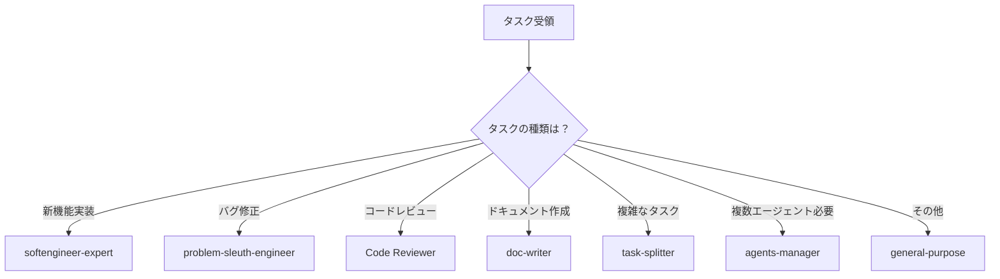

# 🤖 AI開発ルール - Universal App Template

## 📌 大前提
**このプロジェクトのすべての開発・修正はAIが行うことを前提としています。**

人間の開発者ではなく、AIエージェント（Claude、GPT、Gemini等）が作業することを想定した設計・ルールになっています。

---

## 🚨 最重要ルール：必ずサブエージェントを使用する

### 基本原則
**何をするにも、まず適切なサブエージェントを呼び出してください。**

```
1. タスクを受け取る
2. 適切なサブエージェントを選択
3. Task toolでサブエージェントを呼び出す
4. 結果を統合して報告
```

### なぜサブエージェントが必要か
- **専門性**: 各エージェントが特定分野に特化
- **並列処理**: 複数のタスクを同時進行可能
- **品質向上**: 専門的な判断による高品質な実装
- **エラー削減**: 役割分担による責任の明確化

---

## 📋 サブエージェント呼び出しガイド

### 利用可能なサブエージェント

| エージェント名 | 用途 | 呼び出すべき場面 |
|--------------|------|----------------|
| **softengineer-expert** | ソフトウェア作成のプロ | 新機能実装、大規模リファクタリング |
| **problem-sleuth-engineer** | 問題を1ステップずつ解決 | バグ修正、エラー解消、デバッグ |
| **Code Reviewer** | セキュリティとベストプラクティス重視 | コードレビュー、セキュリティチェック |
| **doc-writer** | ドキュメント生成役 | README更新、ガイド作成、API文書 |
| **doc-reader** | ドキュメントを忠実に読み込む | 仕様確認、要件分析 |
| **task-splitter** | タスクを分割して作業しやすくする | 大きなタスクの分解、計画立案 |
| **agents-manager** | サブエージェントたちの管理 | 複数エージェントの調整が必要な時 |
| **general-purpose** | 汎用エージェント | 上記に該当しない作業 |

### サブエージェント選択フローチャート



### 呼び出し例

```javascript
// 新機能実装の場合
Task tool: softengineer-expert
Prompt: "TODOアプリのタスク優先度機能を実装してください。
        src/custom/templates/todo-app/に追加し、
        優先度（高・中・低）でソート可能にしてください。"

// バグ修正の場合
Task tool: problem-sleuth-engineer
Prompt: "ログイン後にデータが表示されない問題を調査して修正してください。
        エラーメッセージ: 'Cannot read property of undefined'
        発生箇所: src/services/database.js"

// ドキュメント作成の場合
Task tool: doc-writer
Prompt: "新しく追加したタスク優先度機能のドキュメントを
        docs/guides/PRIORITY_FEATURE.mdに作成してください。
        使用方法と設定オプションを含めてください。"
```

---

## 📝 サブエージェントが利用できない場合

デバイスの設定によってはサブエージェントが呼び出せない場合があります。

### 対処法
1. **利用可能か確認**: まず呼び出しを試みる
2. **代替手段**: 呼び出せない場合は自身で作業を実行
3. **記録を残す**: サブエージェントが使えなかった旨を記録

### 記録例
```markdown
<!-- docs/ai-conversations/YYYYMMDD_HHMMSS_task_name.md -->
## サブエージェント利用状況
- 試行: softengineer-expert
- 結果: 利用不可（デバイス設定による）
- 代替: メインエージェントが直接実装
```

---

## 🔄 バージョン管理ルール

### マイナーバージョンアップ（+0.01）ルール

**修正を行うたびに必ず +0.01 バージョンを上げる**

#### 対象ファイル
1. `README.md` のバージョン表記
2. `package.json` の version フィールド
3. 該当する更新履歴セクション

#### バージョンアップが必要なケース
- ✅ バグ修正（どんなに小さくても）
- ✅ 機能追加・改善
- ✅ ドキュメント更新
- ✅ スタイル・UI調整
- ✅ リファクタリング

#### バージョンアップ不要なケース
- ❌ コメントのみの追加
- ❌ 開発中の一時的な変更
- ❌ テストファイルのみの変更

### バージョン更新の手順

```bash
# 1. 現在のバージョンを確認
# 例: v0.2.3

# 2. 修正を実施
# （サブエージェントを使用）

# 3. バージョンを更新
# v0.2.3 → v0.2.4

# 4. 更新履歴に記載
# ### v0.2.4 (2025-01-10)
# - 修正内容を簡潔に記載
```

---

## 🚀 GitHub公開ルール

### 公開前チェックリスト

#### 必須確認事項
```markdown
- [ ] バージョン番号を +0.01 更新済み
- [ ] README.mdの更新履歴に記載済み
- [ ] package.jsonのバージョン更新済み
- [ ] テスト実行して問題なし
- [ ] 機密情報が含まれていない
- [ ] Firebase設定が正しい
```

### コミットメッセージ規則

```bash
# 形式
[type] v[version]: 簡潔な説明

# 例
[fix] v0.2.4: ログイン後のデータ表示問題を修正
[feat] v0.2.5: TODOアプリに優先度機能を追加
[docs] v0.2.6: AI開発ルールドキュメントを追加
[style] v0.2.7: モバイル表示のレスポンシブ対応
```

#### タイプ一覧
- `[feat]`: 新機能
- `[fix]`: バグ修正
- `[docs]`: ドキュメントのみ
- `[style]`: スタイル変更
- `[refactor]`: リファクタリング
- `[test]`: テスト追加・修正
- `[chore]`: ビルド・補助ツール

### GitHub Pages自動デプロイ

```yaml
# .github/workflows/deploy.yml が自動実行
# mainブランチへのpush時に自動デプロイ
```

### プルリクエストルール

1. **ブランチ作成**
```bash
git checkout -b feature/v0.2.4-login-fix
```

2. **PR作成時の記載事項**
```markdown
## 変更内容
- v0.2.3 → v0.2.4
- ログイン後のデータ表示問題を修正

## 使用したサブエージェント
- problem-sleuth-engineer: バグ調査と修正
- Code Reviewer: セキュリティチェック

## テスト結果
- [x] ローカルテスト完了
- [x] エラーが解消されたことを確認

## チェックリスト
- [x] バージョン更新済み
- [x] 更新履歴記載済み
- [x] テスト実行済み
```

---

## 📂 ドキュメント配置ルール

### 新規ドキュメントの配置場所

```
docs/
├── ai-development/     # AI開発関連（このファイル）
│   ├── AI_DEVELOPMENT_RULES.md
│   ├── SUBAGENT_GUIDE.md
│   └── VERSION_RULES.md
├── ai-conversations/   # AI作業履歴
├── guides/            # 使い方ガイド
├── setup/             # セットアップ
└── README.md          # ドキュメント一覧（要更新）
```

### ドキュメント作成時の必須作業

1. **適切なフォルダに配置**
2. **docs/README.mdにリンク追加**
3. **関連ドキュメントとの相互リンク**
4. **バージョン番号更新（+0.01）**

---

## 🔍 トラブルシューティング

### よくある問題と対処

| 問題 | 原因 | 対処法 |
|-----|------|--------|
| サブエージェントが呼び出せない | デバイス設定 | 直接実装して記録を残す |
| バージョン番号の重複 | 並列作業 | 最新を確認して調整 |
| GitHub Pages反映されない | キャッシュ | 5-10分待つ、強制リロード |
| テスト失敗 | 依存関係 | npm install実行 |

---

## 📚 関連ドキュメント

- [サブエージェント詳細ガイド](./SUBAGENT_GUIDE.md)
- [バージョン管理詳細](./VERSION_RULES.md)
- [GitHub公開手順詳細](./GITHUB_PUBLISH_GUIDE.md)
- [並列AI作業指示書](../ai-conversations/PARALLEL_WORK_INSTRUCTIONS.md)

---

## 🎯 まとめ

1. **必ずサブエージェントを使う**（使えない場合は記録）
2. **修正のたびに +0.01 バージョンアップ**
3. **コミット前にチェックリスト確認**
4. **ドキュメントは適切な場所に配置**
5. **GitHub公開時は形式に従う**

**Remember**: AIによるAIのための開発ルールです。人間ではなくAIが読むことを前提に書かれています。