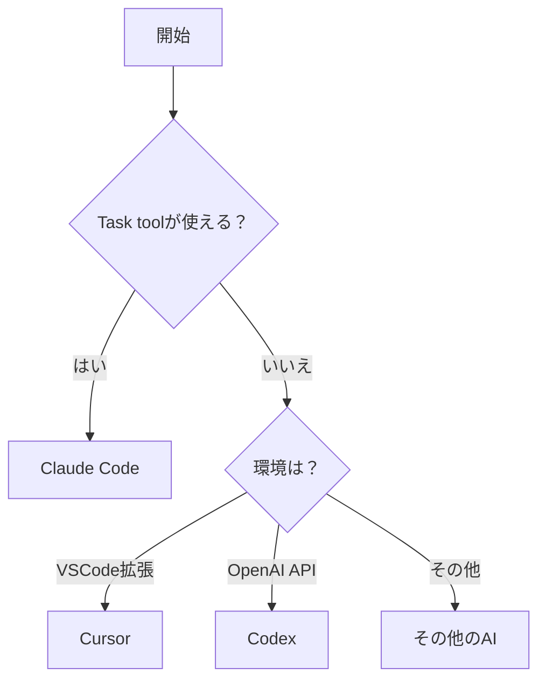

# 🤖 AI種別対応ガイド

## 📌 自分がどのAIか確認する方法

### 判定フローチャート


---

## 🔵 Claude Code 専用ガイド

### 利用可能な機能
- ✅ **Task tool（サブエージェント）**
- ✅ **claude -p コマンド**
- ✅ **並列処理**
- ✅ **Bash/Read/Write等のツール**

### 作業フロー
```
1. タスク受領
2. サブエージェント選択・呼び出し
3. 結果の統合
4. claude -p でダブルチェック
5. GitHub Pages公開
```

### 必須ダブルチェック項目
```bash
# 1. セキュリティチェック（最重要）
claude -p "セキュリティ問題をチェック：
- APIキーの露出はないか
- XSS脆弱性はないか
- 認証バイパスはないか
コード：[該当部分]"

# 2. バグチェック
claude -p "この修正で新たなバグが発生しないか確認：
変更前：[before]
変更後：[after]"

# 3. パフォーマンスチェック
claude -p "パフォーマンス問題をチェック：
- 無限ループはないか
- メモリリークはないか
- 不要な再レンダリングはないか"
```

### サブエージェント活用例
```javascript
// 並列実行で効率化
Task: softengineer-expert - "機能実装"
Task: doc-writer - "ドキュメント作成"
Task: Code Reviewer - "セキュリティレビュー"
```

---

## 🟡 Codex 専用ガイド

### 利用可能な機能
- ✅ **コード生成**
- ✅ **ファイル操作**
- ❌ **Task tool（使用不可）**
- ❌ **claude -p（使用禁止）**

### 作業フロー
```
1. タスク受領
2. 自身で直接実装
3. セルフチェック実施
4. テスト実行
5. GitHub Pages公開
```

### セルフチェックリスト
```markdown
## Codex セルフチェック
- [ ] APIキーや機密情報が含まれていない
- [ ] エラーハンドリングが適切
- [ ] コンソールエラーが出ない
- [ ] 既存機能を壊していない
- [ ] バージョン番号を+0.01更新
```

### 制限事項と対処法
| 制限 | 対処法 |
|-----|--------|
| サブエージェント使用不可 | 自身で全作業を実施 |
| claude -p 使用禁止 | セルフチェックを徹底 |
| 並列処理不可 | 順次処理で対応 |

---

## 🟠 Cursor 専用ガイド

### 利用可能な機能
- ✅ **VSCode統合**
- ✅ **インライン編集**
- ✅ **コンテキスト認識**
- ❌ **Task tool（使用不可）**
- ❌ **claude -p（使用禁止）**

### 作業フロー
```
1. タスク受領
2. VSCode内で直接編集
3. インライン補完を活用
4. セルフチェック実施
5. GitHub Pages公開
```

### Cursor特有の機能活用
```markdown
## Cursor の強み
- コンテキスト理解が深い
- ファイル間の依存関係を把握
- リファクタリングが得意
- コード補完が高速
```

### セルフチェック方法
```javascript
// Cursorのインライン機能でチェック
// 1. 怪しい箇所を選択
// 2. "Explain this code" で確認
// 3. "Find bugs" で問題検出
// 4. "Optimize" で改善提案
```

---

## 📊 AI別機能対応表

| 機能 | Claude Code | Codex | Cursor |
|------|------------|-------|--------|
| **基本機能** |
| コード生成 | ✅ | ✅ | ✅ |
| ファイル操作 | ✅ | ✅ | ✅ |
| テスト実行 | ✅ | ✅ | ✅ |
| **高度な機能** |
| サブエージェント | ✅ | ❌ | ❌ |
| claude -p | ✅ 必須 | ❌ 禁止 | ❌ 禁止 |
| 並列処理 | ✅ | ❌ | ❌ |
| **推奨タスク** |
| 新機能実装 | ◎ 最適 | ○ 可能 | ○ 可能 |
| バグ修正 | ◎ 最適 | ○ 可能 | ◎ 得意 |
| リファクタリング | ○ 可能 | △ 制限あり | ◎ 得意 |
| ドキュメント作成 | ◎ 最適 | ○ 可能 | △ 制限あり |

---

## 🚨 重要な注意事項

### 料金に関する配慮
```
Claude Code: claude -p は必須だが適切に使用
Codex/Cursor: claude -p は絶対に使用しない（料金が余分にかかる）
```

### エラー時の対処
```
Claude Code: サブエージェントが使えない場合は直接実装
Codex/Cursor: エラーは自身で解決（claude -p は使わない）
```

### 品質保証
```
Claude Code: サブエージェント + claude -p でダブルチェック
Codex/Cursor: セルフチェックリストを必ず実施
```

---

## 📚 関連ドキュメント

- [AI開発ルール](./AI_DEVELOPMENT_RULES.md) - 基本ルール
- [サブエージェントガイド](./SUBAGENT_GUIDE.md) - Claude Code向け
- [バージョン管理ルール](./VERSION_RULES.md) - 全AI共通
- [GitHub公開ガイド](./GITHUB_PUBLISH_GUIDE.md) - 全AI共通